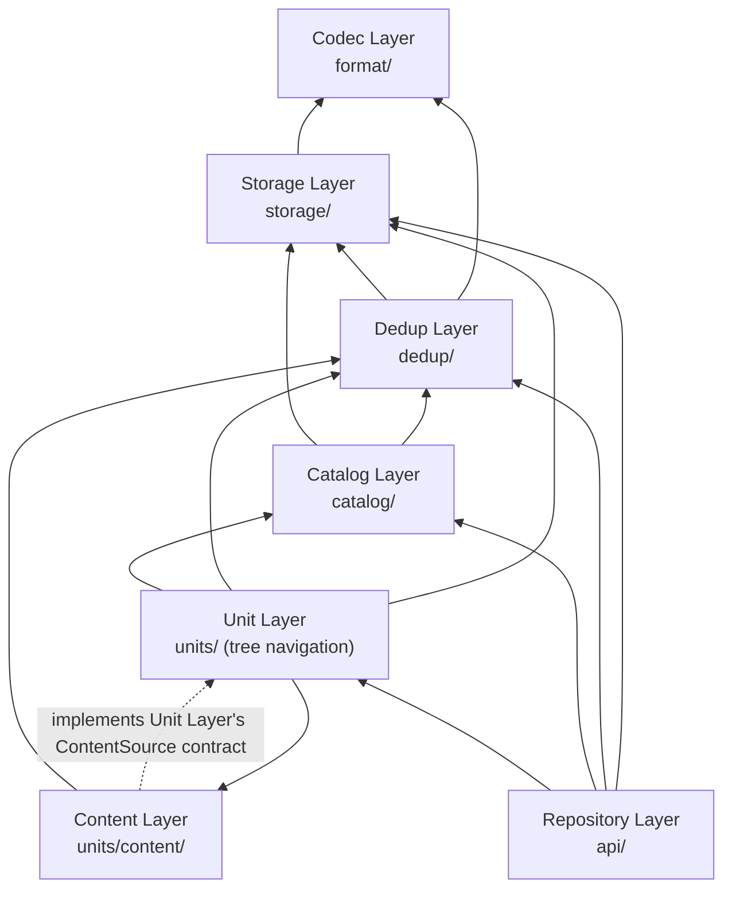

# Architecture

This document is the in-repository, versioned home for this project's **stable design
contract** — the layering, packaging, and cross-cutting conventions that hold
regardless of which feature or bugfix is being worked on. It answers "how is this
shaped, and why" for a new contributor or a new Claude Code session; read the
relevant module's docstring or `git log` for why a specific piece of code
looks the way it does.

---

## What this project is

An offline, read-only reader for Synology ActiveProtect's dedup backup repository
format (APV/Object-Storage). It never talks to a running ActiveProtect service — it decodes the on-disk
bytes of a *copied-out* dedup repository directly, using the format spec in
[`FORMAT-SPEC.md`](FORMAT-SPEC.md). The audience is support/forensics:
verifying a landed backup, or extracting a single file/mailbox item/disk image
out of a repository, without the original backup service running.

Three distributions, one uv workspace:

| distribution | import | role |
|---|---|---|
| `synology-apm-repo-sdk` | `synology_apm_repo.sdk` | Pure Python, offline, read-only. Layered bottom-up; no console scripts, no UI dependency. |
| `synology-apm-repo-cli` | `synology_apm_repo.cli` | Thin CLI, depends only on the SDK. Used by scripts, CI, and integration tests. |
| `synology-apm-repo-browser` | `synology_apm_repo.browser` | Textual TUI, depends only on the SDK (never on the CLI). |

`synology_apm_repo/` itself is a PEP 420 native namespace package — no
distribution may ever ship an `__init__.py` at that level. It is shared by
these three distributions only; family identity across them is carried by
the distribution names (`synology-apm-repo-*`), not by the import root.

Every distribution that ships a command has a console script matching its
own name (`synology-apm-repo-cli`, `synology-apm-repo-browser` — the SDK has
none), and that full name is the only one — `uvx <dist>`/`pipx run <dist>`
run the same-named command by default, and a mismatched name forces every
invocation to add `--from`.

---

## Layers and their contracts

Each layer is *self-contained*: the layer above only needs one data type and one
narrow method set from the layer below, never knowledge of what's two layers
down. This is the single most important structural rule in the codebase — code
review for "does this belong here" almost always reduces to "which layer's
contract does this touch."

| layer | module | responsibility |
|---|---|---|
| Repository Layer | `api/` (+ `diagnostics.py` sibling) | `Session`/`Repository`/`Catalog` facade — the intended entry point for CLI/TUI |
| Unit Layer | `units/` (minus `content/`; includes the `saas/` subpackage — Mail/Drive/Contact/Calendar/Site/Teams/raw providers) | tree navigation: `Node`/`RestorableUnit`/`UnitProvider`/`NodeRef`, provider skeletons, dispatch |
| Content Layer | `units/content/` | concrete `ContentSource` implementations + pure content-rendering functions |
| Catalog Layer | `catalog/` | `Connection`/`Workload`/`Version` — plain SQLite, cheap to enumerate |
| Dedup Layer | `dedup/` | `DedupFile`/`ByteRangeView`: `(stream, session, offset) → bytes` — the core contract |
| Storage Layer | `storage/` | `ObjectStore` + path/generation resolution (seq-id, S3 multi-generation rules) |
| Codec Layer | `format/` | pure `bytes ↔ dataclass` codecs, zero I/O |

Not part of the stack — cross-cutting, reachable from any layer that needs
them. Kernel primitives (`errors.py`, `identifiers.py`, `asynccache.py`) and
`presentation/` are true leaves: zero internal imports of their own, so they
never depend *upward* into `format/`/`storage/`/`dedup/`/`catalog/`/`units/`/
`api/`. `profiles/` (saved S3/Azure/SMB connection profiles) is the one
partial exception — its `build_store()` imports `storage.base.ObjectStore`
to construct the store it returns, a real but narrow dependency on the
Storage layer.



**Catalog sits below Unit, not above:** the Catalog Layer only consumes
Storage/Dedup (reads `db/*` SQLite tables); the Unit Layer needs catalog's
`Version`/`Workload` dataclasses to know which `copy_meta_file` directory or
SaaS stream to open. The reverse arrangement would be circular. Dispatch logic
(`provider_for(version)`) therefore lives in `units/dispatch.py`, not in
`catalog` — catalog exports plain data, never behavior.

**The one contract every layer above Dedup actually depends on** is
`DedupFile`: anything that can compute `(stream_id, session_id, comp_offset)`
gets a logical file with `read(offset, length)` — Catalog and above never
touch buckets, chunks, or crypto directly. The second shared primitive is
`ByteRangeView`, a sub-range view of a `DedupFile` (used identically by FS's
`content_dedup_id`+`file_size` and SaaS's `object_table.(offset, length)`).

### Codec Layer — `format/`, zero I/O

Pure `bytes → dataclass` / `bytes → bytes` functions: header parsing, chunk-map
decoding, SizeStore bit-unpacking, compression, AES-CTR/GCM crypto. This is the
only layer that has to track the on-disk spec bit-for-bit, and the easiest to
test with synthetic bytes (no real sample needed). **Untouched by the async
migration** — there is no I/O here to make async.

Unlike every other layer, a narrow `format/` function is reachable directly
from any layer above it, not just its immediate consumer — the "never
knowledge of what's two layers down" rule above is about avoiding coupling to
another layer's *state* or *I/O*, and a pure, zero-I/O codec function has
neither: `catalog/version.py`'s `decrypt_version_spec`,
`units/verify_reachable.py`'s `group_start_bucket_id`, and
`api/catalog.py`'s `RepoInfo` are real, intentional skip-layer imports, not a
violation. The mermaid graph only draws `format/`'s two most structurally
load-bearing edges (from Storage/Dedup) rather than every such narrow-utility
import, the same simplification it applies to the kernel primitives below.

### Storage Layer — `storage/`, "how do I get these bytes"

`ObjectStore` — four narrow `async def` methods (`read`/`size`/`exists`/
`listdir`), nothing else; async is only genuinely non-blocking for the
network backends (`S3Store`/`AzureStore`) — see "Async-native, by design"
below for why `LocalFsStore`'s async is a thread-hop wrapper, not the real
thing. Implementations: `LocalFsStore` (the
common case), `S3Store`/`AzureStore`/`SmbStore` (built in — always installed,
but their own third-party client libraries are imported lazily to keep import
cost down for callers who never touch them). `SmbStore` follows
`LocalFsStore`'s `asyncio.to_thread()`-wrapped shape, not `S3Store`/
`AzureStore`'s native-async one — `smbprotocol`'s `smbclient` module has no
`aiohttp`-shaped async surface to sit on. **No backend caches anything
per-path** — every `read()` is a fresh, independent fetch (a plain
open+pread+close for `LocalFsStore`/`SmbStore`, a fresh request for
`S3Store`/`AzureStore`); the only state any of them shares across calls is a
transport-level connection pool (`aiohttp`'s TCP/TLS reuse for S3/Azure,
`SmbStore`'s pool of independent sessions — SMB2's per-connection credit-window
flow control starts each connection with room for only one request in flight,
so a pool of independent sessions is what lets several requests actually
overlap without racing each other for that one connection's credit).
`storage/sqlite.py`'s
`open_sqlite()` and `storage/sqlite_source.py`'s `SqliteSource`/`peel()` are
free functions built *on top of* `ObjectStore`, not Protocol methods, split
across two files for two separate concerns: WAL-sidecar materialization for
an already-unencrypted on-disk SQLite file (`open_sqlite()`) and
envelope-stripping (`aHlT` AES-CTR, zstd frames) for an encrypted blob before
a SQLite file even exists (`peel()`) — shared logic every backend needs
identically either way, not something each backend reimplements.
`DirCache` caches every directory listing for a repository's whole lifetime
(re-`listdir()`-ing per lookup turns an export into O(n²) — or, on object
storage, hundreds of paginated list-object calls); `Repository.
invalidate_directory_cache()` is the one way a caller (the TUI's "refresh"
action) drops it deliberately.

### Dedup Layer — `dedup/`, the core contract

The only layer that knows about chunks, buckets, and encryption.
`Pool`/`BucketReader` open `.buk` files and decode individual 4096-byte chunks
(decrypt-then-decompress, never the other order). `CompositionReader` walks a
composition record's chunk-map array. `DedupFile.read()`/`.stream()` combine
these into a byte-addressable logical file, with the `_extents()`/`read()` split
binary-searching into the chunk-map array rather than scanning linearly — this
is a hard performance requirement, not a nice-to-have, once a single file's
chunk-map array can be tens of millions of entries.

`chunk_walk.py` (`plan_chunks_windowed()`/`exec_chunks()`) is the plan/execute
engine every unbounded-range sweep of more than one chunk uses (export,
verify FULL's per-bucket decode) — DATA chunks grouped by
`(stream_id, bucket_id)` and fetched with one merged
`BucketReader.read_chunks()` call per bucket instead of one
`Pool.read_chunk()` per chunk, so a dedup'd file's scattered chunk references
get read in disk order instead of randomly re-visiting the same `.buk` file.
A bounded, already-windowed multi-chunk read (an interactive `read()`
spanning one extent) uses the same grouped-fetch strategy independently,
without going through this module — `dedup_file.py`'s `_fill_data_extent()`
stays independent because its range is always caller-bounded, never a
whole-file sweep, so this module's windowed machinery would only add
overhead there for no gain.
`export_scheduler.py::export_to()` (used by `DedupFile.export_to()`/
`ByteRangeView.export_to()`, `synology-apm-repo-cli export`, and the Content
Layer's `VirtualDiskContentSource`) goes through it — on a real S3-backed
repository this runs two orders of magnitude faster than reading one chunk
at a time. The test suite also keeps a naive per-chunk
path as an independent correctness oracle for the export side.

`synology-apm-repo-cli verify` (`units/verify_reachable.py::verify_reachable()`,
what `Repository.verify()`/`Catalog.verify()` call) walks Catalog → Workload →
Version top-down and only checks data actually reachable from a live,
browsable version — a stale `db/file_map` row nothing reachable still
references is never visited. The check primitives both of
`verify_reachable()`'s levels use live in `dedup/verify_checks.py`, a home
chosen so a fix to one check's logic can't land in a duplicate copy
elsewhere.

`verify_reachable()`'s two levels differ only in how deep the *per-chunk*
check goes — every reachable composition record and bucket is checked
structurally, exhaustively, at both levels (no row/bucket-count cap):
`VerifyLevel.FULL` routes every live
(non-`COMPACTED`) physical chunk in a touched bucket through `exec_chunks()`
itself (ciphertext CRC and decrypt+decompress+fingerprint together, one
merged read per chunk) — as thorough, and as costly, as a real full export of
every live version in the repository, and deliberately not limited to only
the specific chunk-map-referenced indices that caused the bucket to be
touched. `VerifyLevel.QUICK` reads no chunk content at all — its own
per-chunk "depth" is zero, by design; there is no sampled middle tier. Only
FULL does any per-chunk checking.
Buckets are *discovered* by walking Catalog/Workload/Version
serially, but *checked* concurrently once claimed, in batches bounded by a
semaphore — each bucket its own isolated task, so one bucket's failure never
aborts its batch siblings — since I/O-redundancy fixes alone plateau well
before serial, one-bucket-at-a-time checking stops being the bottleneck.
Raising the semaphore's own value further hasn't helped: a small regression
at double the shipped value on a local-disk sample, no measurable
difference at several times the shipped value against a real S3-compatible
object-storage backend — see `git log` for the measurements behind
`_MAX_CONCURRENT_BUCKET_CHECKS`'s current value.

**Validation strength is tiered by context**, because `mapCrc` covers a
chunk-map array that can be hundreds of MB — validating it on every open would
make interactive browsing unusable:

| context | headCrc | mapCrc | bucket header/SizeStore CRC | ChunkCrcStore trailer self-consistency + `expected_bucket_size()` | per-chunk ciphertext CRC | per-chunk fingerprint |
|---|---|---|---|---|---|---|
| interactive read (`read()`, TUI preview, tree expansion) | checked | not checked | checked | not checked | not checked | not checked |
| `export_to()` — every export path, including `synology-apm-repo-cli export` and the TUI export screen | checked | not checked | checked | not checked | not checked | not checked |
| `verify` at `VerifyLevel.QUICK` | checked | checked | checked | checked | not checked | not checked |
| `verify` at `VerifyLevel.FULL` | checked | checked | checked | checked | every live chunk in a touched bucket | every live chunk in a touched bucket |

`export_to()` has no `verify_map_crc` option of its own — chunk-map CRC
validation is `verify`'s job specifically, not export's. Header/SizeStore
CRC is unconditionally checked by `BucketReader.open()` itself, so every
row gets that one for free — but the ChunkCrcStore trailer's own
`crcOfChunkCrc` self-consistency (`BucketReader.ensure_chunk_crc_store()`)
and `expected_bucket_size()`'s real-on-disk-size check
(`dedup/verify_checks.py::check_bucket_structure()`) are verify-exclusive,
called by neither a normal read nor `export_to()`. Per-chunk
ciphertext-CRC/fingerprint verification (`BucketReader.read_chunk`/
`read_chunks`' own `verify_ciphertext_crc`/`Pool.read_chunk`'s
`verify_fingerprint`) is likewise off by default everywhere except
`verify` at `VerifyLevel.FULL`, which forces both on per the table above;
`VerifyLevel.QUICK` leaves both off too.

### Catalog Layer — `catalog/`, cheap enumeration

One sibling module per entity — `catalog/connection.py` (`Connection`,
`connections()`), `catalog/workload.py` (`Workload`, `TargetType`,
`workloads()`/`workload_by_id()`, display-name derivation), `catalog/version.py`
(`Version`/`VersionMeta`, `versions()`, meta-availability checks,
`open_target_db()`) — mirroring the Repository Layer's own `api/`
three-way split below. `catalog/workload_config.py` holds one small shared
constant (`db/workload_config`'s required-column list) both
`connection.py`'s and `workload.py`'s own queries against that table
declare, so the two can't silently drift apart — a leaf module both
depend on, rather than either importing the other's constant directly.
`connections()`/`workloads()`/`versions()` are plain
SQLite queries returning frozen dataclasses, no behavior. Never reads dedup
bytes. `open_target_db()` is the one place this layer does real decrypt work
(`copy_meta_file`'s `target.db`, always `aHlT`-enveloped) — shared by the
Unit Layer's Device and FS providers rather than each independently
resolving+peeling it.

### Content Layer — `units/content/`, decoding what a version's bytes mean

Concrete `ContentSource` implementations, split from the Unit Layer's tree
navigation because they're a genuinely different concern: dumb byte-stitching
(`pcps_disk.py`'s `VirtualDiskContentSource`, reassembling PC/PS disk
fragments — see the Unit Layer section below) versus real decoding/rendering
that reaches for an external library or builds a synthetic file format
(`disk_fs.py`'s Dissect-based partition/filesystem parsing — always
installed, imported lazily for the same import-cost reason; the
`saas_*.py` modules' EML/ICS/CSV assembly and Teams-chat HTML rendering).
`ContentSource` itself stays in `units/base.py` —
a pure structural `Protocol`, no external-library dependency — only its
concrete implementations live here. Every implementation states its own
`supports_concurrent_export` capability directly, rather than the Unit Layer
inferring it via `isinstance` against a concrete class.

### Unit Layer — `units/` (minus `content/`), the minimal restorable unit

`UnitProvider` is one workload version's browsable tree (`root`/`children`/
`unit` — `root()` is sync, the other two are async).

Device (VM/PC/PS), FS, and SaaS (Mail/Drive/Contact/Calendar/Site/Teams/raw)
providers all implement this same shape. **Degradation, not failure, is the
required behavior** when a provider can't identify what it's looking at —
three distinct mechanisms serve this, depending on what's missing: no SaaS
sub-type match at all falls back to a different provider entirely,
`RawObjectProvider` (`units/dispatch.py::saas_provider_for()`); a specific
sub-piece that can't be resolved (a PC/PS disk's missing fragments, no
filesystem recognized on a disk) becomes a synthetic placeholder leaf built
by `diagnostic_node()` (`units/base.py`), its explanation in
`attrs["diagnostic"]`; and an otherwise-fully-browsable node whose display
name alone couldn't be resolved (a Teams chat with no derivable name) keeps
its real content but records why in `attrs["degraded"]`
(`units/saas/teams_chat.py`). None of the three ever makes the whole version
unbrowsable. `units/dispatch.py` picks a provider per `Version`
(`provider_for()`); this lives in `units`, not `catalog`, to avoid a
lower-layer-depends-on-upper-layer cycle.

PC/PS's disk model differs from VM's in one structural way `units/device.py`
has to reconcile: one physical disk lands as *several* independently-
registered fragment objects, not one composition per disk (Windows
`agent-backup` clients segment a disk by partition/volume at backup time).
The actual fragment-name parsing/grouping (the `D(diskUuid)`/`S(diskIndex)`
regex, `_pcps_disk_key()`) lives in the sibling module `units/device_pcps.py`;
the "(filesystem)" sibling-axis diagnostic node built when no filesystem can
be recognized on a disk lives in `units/device_disk_fs.py`; `units/device_kind.py`
holds the small shared node-kind vocabulary both of them and `device.py`
classify against instead of an `isinstance` check on each other's concrete
classes. `device.py` composes these two collaborators (`PcpsDiskTree`,
`DiskFsSibling`) rather than containing this logic inline. The Content Layer's
`VirtualDiskContentSource` reassembles a disk's fragments (grouped by the
`D(diskUuid)`/`S(diskIndex)` in their own filenames) into one `ContentSource`
spanning the whole disk, so nothing above `units/device.py` needs a
PC/PS-specific branch — the CLI `export` command and the TUI export screen
both see the same `size`/`read`/`stream`/`export_to` shape a VM's single-
composition disk image already has. Listing a PC/PS version's
disks stays as cheap as the VM path's own `_object_nodes()`/`_open_object()`
split: grouping only reads `file_meta`'s own `path`/`file_size` columns, and
every fragment's real `locate_file()`/composition I/O is deferred to
`unit()`/open time.

`SaasWorkloadProvider` + `SaasWorkloadConfig` (`units/saas/provider.py`) is the
shared base for Mail/Drive/Contact/Calendar/Site — four of those five modules
are just a `SaasWorkloadConfig` constant plus an `assemble()` function, not a
duplicated provider class; `site.py` and `calendar.py` additionally each build
a `tree_strategy.CategorizedGroupTree` on top of their own inner tree —
one shared wrapper class, not a per-module helper, splitting a tree's own top
level into named categories (Document Library/List for Site, My/Other
Calendars for Calendar). `TeamsChatProvider` is deliberately *not* folded into
that base — its service-DB location mechanism (the object-name index names an
*index object*, itself read once to find the further, per-channel message-DB
object ids — one more level of indirection, not a scan) is genuinely different
from "look up one fixed table name," and forcing it into the shared shape
would make the shared shape worse for everyone else. It still builds its own
channel listing as a `TreeStrategy` (a flat, in-memory tree over the
already-resolved channel/chat index, no I/O of its own) and wraps that same
`CategorizedGroupTree` around it for Channel's own Standard/Private/Shared
split — reusing the identical category mechanism Site/Calendar use, just
without the surrounding `SaasWorkloadProvider` scaffolding. Every application-layer
provider, `RawObjectProvider` included, resolves its content exclusively
through the connector's own object-name index
(`units/saas/object_name_index.py::resolve_object_name_index`); a version whose
object-name index can't be resolved has nothing to show.

### Repository Layer — `api/`, the facade

`Session` (`api/session.py`: discovery, key material, caches, temp-dir
lifetime), `Repository` (`api/repository.py`), and `Catalog`
(`api/catalog.py`: one catalog's own workload/version/provider
operations) are split into sibling modules since each is substantial on
its own, with `api/__init__.py` re-exporting every public name from all
three so a caller never needs to know that split exists. This is the
entry point CLI and
TUI code is built on — neither talks to the Unit/Content/Catalog/Dedup/
Storage layers directly, except for a few narrow, explicitly-named
exceptions (each scoped to one call site) that `api/__init__.py`
enumerates rather than this document duplicating — the list changes as
call sites are added or removed, and a second copy here would just be
one more place for it to drift out of sync.

**`Repository` is one opened bucket or vault — never one connection
within it.** This distinction matters because the two backends' physical
shapes genuinely differ: a vault's several `db/connection_config` rows
share one physical dedup pool (one `Pool`/`Composition`/`db`, opened
once), while an object-storage bucket's several sibling `<repo-id>`
directories are each an independent physical dedup pool of their own
(FORMAT-SPEC.md: no cross-repo-id dedup) — `Repository` opens one
`DedupRepo` for a vault, or one per sibling repo-id for object
storage, lazily, and hides that difference
entirely: `Repository.catalogs() -> list[Catalog]` is the one, uniform
way to enumerate what's inside, for either backend. `Catalog` (one
`connection_config` row for a vault, one repo-id's worth of data for
object storage) is where the actual browsing operations live —
`workloads()`/`versions()`/`provider()`/`verify()`/`walk_human_ref()`/
`connection`/`info`/`display_name`/`catalog_id`. `Repository` itself keeps only what's genuinely bucket/
vault-wide: `is_encrypted`/`key_status`/`key_verification`/`set_key()`
(one shared key tree either way), `catalogs()`, `verify()` (aggregated
across every *distinct* opened `DedupRepo` — a vault's several
`Catalog`s share one, so this doesn't re-run the same check once per
sibling), `resolve()`/`walk_human_ref()` (thin dispatchers: pick the
right `Catalog` by its first ref segment, then delegate the rest to
`Catalog.walk_human_ref()`), and `close()`.

`is_encrypted` answers "is this repository encrypted" — no catalog ever opened,
no Pool scan, and (unlike an async method) no I/O at the point a caller
actually reads it: `Session.discover()`/`Session.open()` already resolve
it eagerly, once, before constructing each `Repository` — passed in as
that constructor's own `encrypted` argument — by reading
its own encryption-key record directly (`db/vault_encryption_key`'s
latest row for VAULT, the `@ActiveProtectKey/userKey/` object listing for
OBJECT_STORE — see `dedup/keys.py`'s `probe_encrypted()` for the exact
mechanism) — this needs only the bucket-level layout, never a specific
opened `DedupRepo`, which is what makes resolving it before anything
is opened possible at all.

`Repository.catalogs()` never gates on key state up front — the tables
each catalog's own listing reads (`connection_config`, `workload_config`)
are genuinely unencrypted plaintext, key or no key, and opening a
`DedupRepo` itself never requires one to be given at all. A key that
*was* given but doesn't match, though, still makes that `DedupRepo`'s
own open raise `KeyMismatchError` — `catalogs()` surfaces that immediately
rather than quietly excluding the catalog, the same as any other open
failure. `Catalog.workloads()`/`versions()`, by
contrast, raise `KeyRequiredError`/
`KeyMismatchError` before any catalog I/O once a repository is *confirmed* encrypted
(`is_encrypted is True`) and not yet key-verified — without this, a
locked repository's version list would otherwise come back silently empty
(`version_spec` fails to decrypt, so no row passes the browsable-status
filter), indistinguishable from "this workload genuinely has no
backups." Gating at the SDK level is what lets every consumer (CLI, TUI, a
smoke-test tool, ...) get this for free without an equivalent client-side
check of its own, while still preserving the TUI's own flow: catalog names
show up before any key prompt, which only appears once a catalog is
actually opened for browsing. Deliberately narrower than "any key-status
other than verified": a repository whose encryption status itself couldn't be
resolved (`is_encrypted is None`, a rare case) is left ungated rather than
presumed encrypted. `Repository.verify()`/`Catalog.verify()` share this
exact same gate, for the same reason — `units.verify_reachable`'s own
top-down walk discovers versions through `catalog.versions()`, the same
call whose browsable-status filter would otherwise silently see none of
them and report a misleadingly clean integrity check instead of refusing
to run.

`NodeRef` is the canonical, round-trippable address format shared by CLI
arguments, TUI breadcrumbs, and error messages, with a `human` display
form (`#Test-Workload-02/CORP-PC-001/...`) and a `canonical` form
(`#cat:1/wl:2/ver:<uid>/...`) that both parse back to the same `Node`.
The `cat:` segment is a `CatalogId` (a plain string) — a vault's
`str(connection_config_id)` (already unique
within it), or an object-storage catalog's own repo-id string (needed
since each sibling's own `connection_config` table independently starts
at 1, so a bare `connection_config_id` can't tell two siblings apart).
`Catalog.provider()`/`workloads()`/`versions()` are always reached
*through* a `Catalog` obtained from `Repository.catalogs()` — nothing
above the Repository Layer scans across catalogs by id. `file_map_tree()`,
a diagnostic-only escape hatch, resolves straight from `db/file_map` on
the first catalog when catalog metadata is missing or unhelpful — the
fallback axis of last resort, gated behind the CLI's `--verbose` /
the TUI's own `verbose` toggle (`d` key) — same concept, same name, on
both sides; a `RAW` ref's grammar carries no catalog
segment at all, so it doesn't disambiguate between object-storage
siblings, a pre-existing limitation of this axis rather than something
new here.

---

## Async-native, by design

The whole SDK, CLI, and TUI are async-native end to end:

- **`asyncio.to_thread()` is used for exactly one reason: getting a single
  blocking call off the event loop** — `LocalFsStore`'s syscalls (`pread`,
  `fstat`, `iterdir`; there is no async-native local-file I/O in CPython, this
  is the same technique `aiofiles` uses internally), `SmbStore`'s calls into
  `smbprotocol`'s synchronous `smbclient` module (no `aiohttp`-shaped async
  surface to sit on, unlike S3/Azure below), and `BucketReader._read_run`'s
  batch chunk decode/decrypt — one hop per merged run of chunks, not per
  chunk, so the round-trip amortizes; the single-chunk interactive path,
  `BucketReader.read_chunk`, decodes inline instead, since one 4096-byte
  decode is cheaper than a thread hop. **It never parallelizes CPU-bound work,
  no matter how many OS threads dispatch it** — decompress/decrypt/hash all
  serialize under CPython's GIL regardless (see `git log` for
  `concurrency.py`'s profiling history).
- **Real multi-core parallelism, where this CPU-bound work is heavy enough
  to be worth it, comes from a `concurrent.futures.ProcessPoolExecutor`
  instead** — verify FULL's per-bucket decode sweep
  (`units/verify_reachable.py::check_all_buckets`) and export's
  bucket-group decode (`dedup/chunk_walk.py::exec_chunks`'s multiprocess
  counterpart, dispatched from `dedup/export_scheduler.py`). Sized by
  `concurrency.default_worker_count()` (`clamp(os.cpu_count() // 2, 1, 8)`
  — the `// 2` deliberately biases toward a machine's faster cores: on an
  asymmetric-core machine, some tasks land on the slower cores, and since
  these call sites synchronize a whole batch at a shared boundary, the
  batch's own completion time is dragged down to whichever task landed on
  a slow core — using every core measurably makes the batch slower, not
  faster). Applied unconditionally wherever it structurally applies — no
  size threshold gates it off for a small input — except when the
  repository's `ObjectStore` can't be reconstructed inside a fresh process
  (`storage.store_descriptor.describe_store()` returns `None`: a
  `TracingStore`/`RecordingStore` wrapper, or a store built from an
  already-live injected client), in which case the original
  single-process/`asyncio` path is used instead, silently and correctly.
  `concurrency.dispatch_to_pool()` is the one shared "bounded, dynamically
  load-balanced dispatch of N items to a process pool" primitive both call
  sites use — a free worker always picks up the next not-yet-started item
  via the executor's own internal queue, which measurably beats even an
  exactly-balanced *static* partition of the same work decided ahead of
  time, since real per-item cost isn't perfectly predictable from a cheap
  proxy metric. A worker process handles many such items over its whole
  lifetime, so its per-task entry point drives each one via
  `concurrency.run_in_worker_loop()` — one persistent event loop, lazily
  created and reused across every task that worker ever runs — rather than
  `asyncio.run()`'s own throwaway-loop-per-call shape, which would silently
  orphan a worker-lifetime resource lazily bound to the first loop it saw
  (an `S3Store`/`AzureStore` client, say) the moment that first loop closed.
  `concurrency.close_worker_loop()` releases it gracefully, called from an
  `atexit` hook each worker's own initializer registers.

  A known, accepted cost of export's own windowed multiprocess dispatch: a
  bucket independently re-referenced (via internal dedup) at two
  logically-far-apart points in a file can land in two different
  `plan_chunks_windowed` windows and get opened/decoded twice — measured
  ~12% of buckets on a real 32GB VM fixture. The duplication comes from
  genuinely separate references, not a splittable run, so no windowing
  change removes it.
- **`S3Store`/`AzureStore`** are the one place async is *actually* non-blocking
  (network I/O via `aioboto3`/`azure.storage.blob.aio`, both on `aiohttp`) —
  genuinely different from the local-file/SMB cases above.
- **`aiosqlite`** everywhere SQLite is touched — not `sqlite3` wrapped in
  `to_thread()` — specifically because it dedicates one background thread to a
  connection's whole lifetime, which structurally eliminates the
  cross-thread-close hazard `check_same_thread=False` alone doesn't guard
  against. **The cost of that guarantee: every connection must be closed.** That
  background thread is created *without* `daemon=True`, so a single leaked
  connection makes `threading._shutdown()` block forever and the interpreter
  never exits. This is why `Repository` tracks every provider it hands out,
  why `SaasWorkloadProvider.close()` also closes its `SaasStream`, and why
  `ObjectDb.from_bytes()` closes its `SqliteSource` when introspection fails.
  Whatever opens one owns closing it, on every path including the error paths.
  A cache reusing many such connection-holding objects across one long run
  also needs an upper bound on how many stay open *concurrently* — a
  guarantee they eventually close isn't enough on its own, since "eventually"
  can mean "after a single run has already opened hundreds of them at once."
  `units.saas.stream.SaasStreamCache` is this project's example: an
  LRU-bounded cache that closes an evicted stream immediately rather than
  leaving it to a future close pass. Hand-rolled instead of built on
  `AsyncKeyedCache`, which has no hook for that kind of eager close on
  eviction.
- **Cancellation is native `asyncio.CancelledError`/`Task.cancel()`**, not a
  `threading.Event` parameter threaded through every long-running call.
- **`Table.__init__` cannot be `async def`**, so schema introspection
  (`storage/table.py`) uses an async classmethod factory, `Table.create(...)` —
  the standard Python idiom for "needs an await at construction time" (same
  shape as `asyncpg.connect()`), not a workaround.

---

## Presentation: users see backups, not a dedup repository

CLI and TUI users are support engineers or end users, not format researchers.
Internal identifiers (`connection_config_id`, `stream_id`, `object_id`, bucket
numbers) **never appear in the default view** — only in an explicit verbose
mode (`--verbose` / TUI's `d` key), with one deliberate carve-out: the TUI's
own exception-message display (see "Cross-cutting shared mechanisms" below)
always shows an `ApmRepoError`'s full detail, `ref=`/`spec=` tags included,
regardless of the `d` toggle — the CLI's equivalent (`friendly_message()`)
still gates on `--verbose` as this rule states. The user-visible hierarchy
is always:

```
backup source → workload → version (named by backup time) → item
```

SaaS's internal stream/snapshot/ObjectDB/service-DB machinery is entirely a
provider implementation detail; it never becomes a browsable level. This
extends to error messages and progress text — a `diagnostic_node()`
placeholder (see the Unit Layer section's degradation mechanisms) shows a
short, already-specific label as its listing name unconditionally (e.g.
"(no filesystem recognized on this disk)"), while the fuller technical
explanation carried in `attrs["diagnostic"]` only surfaces if that node is
actually opened, as the `NotFoundError` it then raises — gated by the same
`--verbose`/`d`-key mechanism as any other error (`ApmRepoError.safe_message`,
below), not a separate placeholder-substitution mechanism of its own.

---

## Cross-cutting shared mechanisms (worth knowing before you reinvent one)

- **`concurrency.py` / `storage.store_descriptor` / `dedup.pool_descriptor`**
  — real multi-core parallelism for CPU-bound decode work, as a trio: the
  first owns "how many worker processes to use, how to dispatch a batch of
  independent work items to them, and how each one drives its own tasks
  over its whole lifetime" (`default_worker_count()`, `new_process_pool()`,
  `dispatch_to_pool()`, `run_in_worker_loop()`/`close_worker_loop()`); the
  second, "can this repository's `ObjectStore` be rebuilt inside a fresh
  process, and how"
  (`describe_store()`/`rebuild_store()`, one backend at a time, never
  raising — `None` means "no, fall back"); the third, "rebuild an
  equivalent `Pool` from one of those descriptors" (`PoolDescriptor`/
  `build_worker_pool()`). `units/verify_reachable.py` (FULL level) and
  `dedup/export_scheduler.py` are today's two call sites — see the
  "Async-native, by design" section above for why this exists and what it
  measured. A third call site wanting the same real parallelism for its
  own CPU-bound work should reach for this trio, not stand up its own
  `ProcessPoolExecutor`. Building the very first `ProcessPoolExecutor` in a
  process whose `sys.stderr` has been replaced by a stream whose
  `fileno()` returns a sentinel instead of raising — Textual's own output
  capture does this for an `App`'s whole run — crashes with `ValueError:
  bad value(s) in fds_to_keep`, since `multiprocessing`'s resource tracker
  blindly forwards that value when it launches its own one-time helper
  process; `concurrency.preload_resource_tracker()` sidesteps this by
  launching that helper up front, while `sys.stderr` is still real —
  `browser/app.py::main()` calls it before `.run()` for exactly this
  reason.
- **`RecordingStore`/`ReplayStore`** (`storage/recording.py`) — wraps a real
  `ObjectStore`, records every call/result pair, and replays it with zero real
  I/O. This is how a handful of real, production-shaped bytes become a
  committable, sample-independent test fixture (a few hundred KB to a couple
  MB uncompressed; committed gzip-compressed as `tests/fixtures/*.json.gz`,
  smaller still) instead of requiring the real sample tree itself. Also backs
  `TracingStore`, wrapping the same four narrow methods to drive the CLI's
  `--trace` flag.
- **`peel()` / `SqliteSource`** (`storage/sqlite_source.py`) — every one of this
  project's several envelope→SQLite paths (repository `db/<name>`, `copy_meta_file`'s
  `target.db`, `version.db.zst`, SaaS service DBs, ...) reduces to at most two
  envelope layers (`aHlT` AES-CTR, then optionally a zstd frame), auto-detected
  by magic bytes. Any module doing its own magic-byte sniffing instead of
  calling `peel()` has drifted from this convention.
- **`Table`/`Column`** (`storage/table.py`) — schema-tolerant SQLite table
  access: declare required/optional columns, and a missing optional column
  reads back as `None` instead of raising `sqlite3.OperationalError`. Every
  workload DB in this project has schema drift across connector versions; this
  is the one place that's handled, not re-handled per call site.
- **`identifiers.py`** — the various same-shaped-but-different-namespace IDs
  (`connection_id` vs `connection_config_id`, `version_id` vs `version_uid`,
  ...) are `NewType`s, specifically so mypy catches a mixed-up ID at the type
  level instead of it silently reading the wrong row at runtime. `target.db`'s
  own on-prem-minted `version_uuid` is a related but distinct namespace worth
  knowing about too — easy to confuse with `VersionUid` (the server-minted
  Copy-version UUID) despite the similar name, but it isn't itself modeled
  as a `NewType` (nothing else in the SDK references it).
- **`presentation/`** — anything that must render identically in the CLI and
  TUI (progress/ETA formatting, byte-size formatting) lives here, in the SDK,
  once — not duplicated per frontend. "CLI and TUI disagree" is a bug by
  definition for anything in this module. (`NodeRef`'s human-form rendering
  and `disambiguate()` are the same kind of shared-once mechanism but live in
  `units/node_ref.py` instead, since they're address logic, not display
  formatting; `dedup/verify_report.py`'s `group_findings()`/`sort_key()` are
  the same idea again for grouping/ordering a `Repository.verify()` result,
  but live in `dedup/` instead, since `presentation/` is a true leaf with
  zero internal imports of its own and this logic needs `Finding`, which
  lives one layer up.)
- **`ApmRepoError.safe_message`** (`errors.py`) — the message alone, with the
  `ref=`/`spec=` tags `str(exc)` appends stripped, so the same exception can
  render two ways: full detail, or that detail stripped down. Only the CLI's
  `cli/errors.py::friendly_message()` actually picks between the two, gated
  on `--verbose` — the mechanism behind the Presentation section's
  error-message claim above. The TUI does not: it always renders an
  `ApmRepoError` via plain `str(exc)`, `d`-toggle or not — a deliberate,
  scoped exception to that same claim (see the Presentation section itself
  for why), not an oversight.
