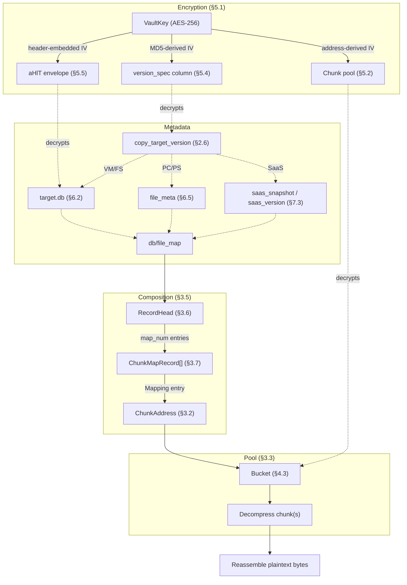

# FORMAT-SPEC

## Overview

The main path from a workload's version to its actual bytes on disk: how
versions are listed, how each workload type resolves a version to a
`db/file_map` lookup key, and how that key's content is addressed and
(optionally) encrypted on disk. Shows the key waypoints only, not every
table involved or how a version's individual files/objects are enumerated
— §6/§7 cover each workload's own listing mechanism in full. §8 is the
step-by-step restore procedure that walks this same chain:



---

## §1. Scope & conventions

This document specifies the on-disk dedup backup repository format Synology
ActiveProtect writes when a backup is copied to an APV (ActiveProtect Vault)
or Object Storage (S3/Azure) destination — everything a reader needs to open
a landed repository copy and recover a backed-up file's plaintext content
offline.

A byte range `[a, b)` is half-open — inclusive of `a`, exclusive of `b`;
every multi-byte integer field is big-endian.

---

## §2. Repository layout & versioning

### §2.1 Locating the repository root, and directory layout

A repository root is found differently depending on destination type, and
never nested arbitrarily deep:

- **Vault** (APV, or any local-filesystem Copy destination): a directory
  (conventionally named `@ActiveProtectVault`, though the name itself
  isn't load-bearing — detection is by content marker, not name) *is* the
  repository root directly, created exactly one level under the
  admin-chosen shared folder. Identified by the coexistence of
  `repo_info`, `link.key`, and `.fully_created` at that exact path —
  `link.key` itself is checked only for existence, never opened; the
  *separate* `db/vault_link_key` table carries this connection's real,
  readable display name (§2.3).
  Exactly one repository per such root, and exactly one vault per shared
  folder.
- **Object storage** (S3/Azure landed copies): the root contains an
  `@ActiveProtectData/<12-char-repo-id>/` subtree, possibly with several
  sibling `<repo-id>` directories, and a parallel
  `@ActiveProtectKey/{userKey,link}/` tree one level up from
  `@ActiveProtectData` (see §5.3 for what lives under `userKey/`). Each
  `<repo-id>` is an independent repository sharing the same key tree.

Once the root (`<repoRoot>`) is identified, it has this top-level shape:

```
<repoRoot>/
├── repo_info                # header + JSON payload, see §2.5
├── db/
│   ├── file_map              # SQLite, no file extension — see §2.2
│   ├── vault_link_key         # VAULT only — see §2.3
│   ├── workload_config, copy_target_version   # see §2.6
│   └── ...                   # other repository-level SQLite databases (connection
│                              # config, copy-tracking tables, etc.)
├── copy_meta_file/            # PC/PS/VM/FS version file-listing metadata — see §6
├── saas/                      # SaaS workload account-level metadata
├── .fully_created             # repository-creation-complete marker
└── @data/
    ├── Pool/                  # bucket data files (.buk) and sidecars (.inf/.fgp) — §3, §4
    ├── Composition/           # composition files (.com directories, c<N> sub-files) — §3
    └── repo_transaction        # Vault destinations only — see §2.4
```

> This document's vocabulary is format-neutral (`<repoRoot>` above is
> always just "a repository"). `synology_apm_repo.sdk`'s API layers a
> naming convention on top: the bucket-or-vault shared folder (one shared
> key tree — an object-storage bucket holding several sibling
> `<repo-id>`s, or a vault) is `api.Repository`; one connection's worth of
> data within it (one `db/connection_config` row for a vault, one
> `<repo-id>`'s worth of data for object storage) is `api.Catalog`; the
> per-connection data row itself (e.g. §2.3's display name) is
> `catalog.Connection`. This is the canonical statement of that mapping —
> see `ARCHITECTURE.md`'s "Repository Layer" section for the API contract
> built on it. Separately, "bucket" is overloaded below: an S3/Azure
> storage container (as just used above) versus a dedup-pool `.buk` data
> file addressed by `bucketID` (§3.2 onward) — the two are unconnected;
> context disambiguates which one a given mention means.

### §2.2 `db/file_map`

`db/file_map` is a SQLite database (the file itself has no `.db`
extension) holding one table, keyed by file path, that is the entry point
for locating any file's content:

| Column | Type | Notes |
|---|---|---|
| `path` | TEXT, primary key | Exactly one row per path — the row always reflects that path's *current* (latest) backed-up location, never a history. |
| `crtime`, `mtime` | — | Not needed to locate or read content. |
| `stream_id` | — | Together with `session_id`/`comp_offset`, the addressing triple — see §3.9. |
| `session_id` | — | See §3.9. |
| `comp_offset` | — | See §3.9. |
| `block` | — | Chunk count covering this file; not needed to read content. |
| `status` | INTEGER | `0`=Initialized, `1`=Written, `2`=Complete, `3`=Compacted, `4`=Corrupted, `5`=Tainted. Only a `Complete` row should be trusted as fully readable. |

There is a unique index on `(stream_id, session_id, comp_offset)` — the
same triple is also `db/file_map`'s *value*, so this index is really an
inverse lookup, not an alternate primary key. A `.buk` file's content can be
fully decoded without ever consulting `file_map` at all — it is purely the
mapping from a human-meaningful path to the addressing triple.

### §2.3 `vault_link_key` / connection naming

Every connection — one originating APM connection this repository has
received Copy data from — has a human-readable display name landed
somewhere near the repository root, in a destination-dependent form:

- **Vault**: `db/vault_link_key`, a SQLite table with a single column,
  `key`, one row per landed link name.
- **Object storage**: the `@ActiveProtectKey/link/` directory (a sibling
  of `userKey/`, §5.3) — its entries' *names*, not their contents, carry
  the same information; list it rather than reading any file inside it.

Either way, the set of candidate names is the same shape: strings of the
form `"<connection_id>_<discarded>_<name...>"` — three segments, two
structural underscores. To recover one connection's display name, find
the candidate whose `<connection_id>` prefix matches, then split on the
first two `_` characters (the name itself may legitimately contain
further underscores) and keep only the third segment; the second segment
carries no meaning this SDK uses. A `connection_id` with no matching
candidate simply has no better display name than its own raw id.

### §2.4 Multi-generation selection (S3/Azure destinations)

Files with a "current generation" tend to be replaced in place with a
numbered variant, `<name>.<N>` — the general sequence-suffix mechanism
described in §3.4. For `db/<name>` databases specifically (`db/file_map`
and the rest of `db/`), the numerically-largest-suffix rule does **not**
apply on S3/Azure destinations: unlike bucket/composition files, old
`db/<name>.<N>` generations are not cleaned up there, and a generation can
be uploaded before the transaction referencing it is committed. The
correct generation instead requires two auxiliary directories at the
repository root, `repo_transactions/` and `suppl_transaction_ids/`, and a
two-branch rule:

1. **Find the latest committed transaction id.** Take the
   numerically-largest-suffixed file under `repo_transactions/`,
   `repo_transaction.<N>` — but the answer is *not* that filename's own
   `<N>`. Open the file (header + JSON payload, same shell as §2.5) and
   read its `transaction_id` field; that field's value is always `>=` the
   filename's own number and is the actual latest committed transaction id.
2. **For `file_map`, `repo_info`, and every other non-supplemental
   `db/<name>`**: among that name's `.<N>` suffixes, take the largest one
   *strictly less than* the latest committed transaction id from step 1. A
   suffix equal to or greater than it was written at or after that
   transaction and is not yet (or not still) committed.
3. **For nine specific "supplemental" tables** — `agent_connection`,
   `connection_config`, `copy_file`, `copy_source_version`,
   `copy_target_version`, `copy_target_version_meta`, `copy_target_file`,
   `file_meta`, `workload_config` — a different, independent rule applies:
   take the largest `.<N>` suffix that *also* has a matching empty marker
   object `suppl_transaction_ids/<N>`. This numbering is unrelated to the
   transaction-log numbering in steps 1–2.

`copy_target_file` in that list is a special case: it has no on-disk object
of its own at all, at any suffix. Its rows live inside whichever
`copy_target_version[.N]` file the above rule resolves to — both tables are
written to the same physical SQLite file and share the same generation
numbering.

An unsuffixed `db/<name>` object is a different case from §3.4's general
"no suffix is also valid" rule, and that rule does **not** carry over
here: whenever at least one `.<N>` variant exists for a given name, a
coexisting bare file never participates in either branch of the
two-branch rule above — selection happens only among the `.<N>` suffixes.
Only when *no* `.<N>` variant exists at all for that name does a reader
fall back to the bare name directly, on the assumption that no generation
has been written yet for it; this does not attempt to distinguish that
case from a stray 0-byte artifact left behind by something having opened
that path directly with a generic SQLite tool.

Vault (APV) destinations do not need any of this: a Vault repository's
current-transaction state is tracked instead by a single file,
`@data/repo_transaction`, overwritten in place with no generation suffix at
all — the concept of "commit state as of this landed copy" reduces to
"whatever this one file currently says."

### §2.5 `repo_info`

`repo_info` is a 64-byte header (magic `RpiF`) plus a JSON payload.
Opening a repository always reads and structurally validates this file
first (magic, header CRC32, JSON parse) — a missing or corrupt
`repo_info` blocks opening the repository at all — following the same
generation-selection rule as `db/file_map` on S3/Azure destinations
(§2.4).

Within the generic header's 52-byte format-specific payload region
(§3.1), `repo_info` packs `json_crc` (big-endian u32) at offset 8 and
`data_size` (big-endian u64) at offset 12 — together framing the trailing
JSON payload (its byte length and its own CRC32, checked separately from
the header CRC) — followed immediately by a 16-byte ASCII `uuid` at
offset 20: the repository's own UUID, parsed for display/diagnostics
only. The remaining bytes up to offset 60 are unused.

### §2.6 `workload_config` & `copy_target_version`: catalog metadata schema

Two more repository-root SQLite tables carry the JSON payloads that classify a
workload and browse its versions — the catalog layer's own primary
inputs, distinct from `repo_info`'s repository-wide metadata (§2.5).

**On-disk `target_type`/`sub_type` values.** `workload_config.workload_type`
and `copy_target_version.target_type` are always one of six literal
strings: `VM`, `PC`, `PS`, `FS` (device workloads) or `GW`, `M365` (SaaS
connector kinds — `GW` is Google Workspace, referred to informally as
"GWS" but never spelled that way on disk). For a SaaS workload, a second
field distinguishes application: `workload_config.workload_spec`'s own
`spec.workload_type` (see below) is one of `MAIL`, `CONTACT`, `CALENDAR`,
`DRIVE`, `USER_DRIVE`, `SITE`, `USER_EXCHANGE`, `TEAMS`, `USER_CHAT`,
`TEAM_DRIVE`, `GROUP_EXCHANGE`. Every value maps to exactly one restore
mechanism except `USER_EXCHANGE`/`GROUP_EXCHANGE`, each of which bundles
Mail+Contact+Calendar as three independently-populated services within
the same version (§7.3) rather than one single mechanism; `TEAM_DRIVE`
and `GROUP_EXCHANGE` are the group/shared-mailbox counterparts of
`USER_DRIVE`/`USER_EXCHANGE` respectively, reusing the same schema — GWS
has no `GROUP_EXCHANGE` equivalent (Google Workspace Groups are mailing
lists, not shared mailboxes with their own Calendar/Contacts).

**`workload_config.workload_spec`** (JSON): a top-level `namespace` field
(a backup-server-internal bookkeeping id, distinct from any
tenant/domain identity below) plus a nested `spec` object:

| Field | Present for | Meaning |
|---|---|---|
| `spec.workload_name` | device workloads | The name driving display-name derivation. |
| `spec.config_vm.os_name` / `.hypervisor_name` | VM | Subtitle detail. |
| `spec.config_fs.os_name` | FS | Subtitle detail. |
| `spec.workload_type` | SaaS | The `sub_type` enumerated above. |
| `spec.tenant_id` | M365 | The real M365 tenant GUID. |
| `spec.domain` | GW | The real GWS domain, already a plain string (unlike M365, which carries no plain-domain field anywhere). |

A SaaS workload's own display name (a user/site/group/team identity, not
the connector kind) comes from a second, independent path within this
same `workload_spec` JSON: its own top-level `status.entity_meta.spec`
(not to be confused with `version_spec`'s own, differently-shaped
`status` object below), holding exactly one of `user_info`
(`{name, email}`), `site_info` (`{site_name}`), `group_info`
(`{display_name, mail}`), `team_drive_info` (`{name}`), or `team_info`
(`{name}`), depending on which kind of entity this workload represents.

**`copy_target_version.version_spec`** (JSON, encrypted per §5.4 whenever
the connection has a vault key): a `status` object carrying:

| Field | Meaning |
|---|---|
| `status.status` | Lifecycle state. `COMPLETED`/`PARTIAL`/`CANCELED` mean this version has real, landed data worth listing (a canceled job can still have transferred data before it stopped); every other value (`BACKING_UP`/`FAILED`/`PAUSED`/`DELETING`/`DELETE_FAILED`/`CLONING`/`CMS_PROCESSING`/`NONE`) means nothing landed. |
| `status.start_time` / `end_time` | Epoch seconds, encoded protobuf-JSON-style as a **string** (e.g. `"1786024626"`); `"0"`/`0` is the proto's own "not set" sentinel, not a real 1970 timestamp. |
| `status.additional_meta` | Itself a **JSON string** (double-encoded), holding this version's object-name index — see below. |

**`status.additional_meta`**, once its own JSON string is parsed, holds
`object_db_id` (the same self-describing `"<streamUuid>_<offset>_<length>"`
address introduced in §7.3) and `db_object_ids.db_objects`, an array of
`{name, object_id}` pairs — the connector's own record of exactly which
object, inside this version's `saas_obj` stream, holds each named service
DB. This is the *normal*, indexed path every SaaS provider resolves a
service DB through; §7.3's offline `object_table`-reconstruction procedure
is the fallback for when this bookkeeping is missing or fails to parse,
not the primary mechanism.

---

## §3. Addressing: ChunkAddress → Composition → ChunkMapRecord → file_map

### §3.1 The generic 64-byte header shell

Every binary format in this repository — bucket files, composition files,
`repo_info`, and more — opens with the same generic 64-byte header shell:

| Offset | Size | Field |
|---|---|---|
| 0 | 4 | magic (ASCII) |
| 4 | 2 | major version (big-endian) |
| 6 | 2 | minor version (big-endian) |
| 8 | 52 | format-specific payload |
| 60 | 4 | header CRC32 (big-endian), covering bytes `[0,60)` |

Reading validation order is identical everywhere: check the magic, then the
header CRC32, then accept the file only if its major version does not
exceed what this reader supports (minor version is never checked on read —
any minor value is accepted). Known magic values:

| Magic | Format |
|---|---|
| `bFiL` | Bucket data file (`.buk`) — §4 |
| `GMet` | Bucket info file (`.inf`) top-level header — §4.5 |
| `RpiF` | `repo_info` — §2.5 |
| `rPTs` | `repo_transaction` — §2.4 |
| `cMpS` | Composition sub-file header — §3.5 |
| `aHlT` | `copy_meta_file` file-level encryption envelope — §5.5 |

`.fgp` fingerprint files (§4.5) have no header of their own at all.

### §3.2 `ChunkAddress`

A `ChunkAddress` is a single 64-bit value packing three fields:

```
bit  63........56  55..................16  15........0
    | streamID(8) |     bucketID(40)      | chunkIdx(16) |
```

- `streamID` (8 bits): which dedup stream (a small per-open-file integer,
  distinct from any workload-level UUID).
- `bucketID` (40 bits): which bucket file within that stream's Pool — up
  to 2⁴⁰ buckets.
- `chunkIdx` (16 bits): which chunk slot within that bucket — but a
  bucket's real capacity is only 2¹³ = 8192 chunks (§4), well under the
  16-bit field width.

Advancing a `ChunkAddress` by `k` chunks (needed to expand a chunk-map
entry's run of consecutive chunks, §3.7) must carry into `bucketID` at the
8192-chunk boundary, not at the packed field's 16-bit boundary — treating
the raw 64-bit value as a flat integer and adding `k` to it would misplace
the carry.

Every chunk is a fixed 4096 bytes of *plaintext* — the dedup engine's fixed
chunking granularity throughout this entire format. Every chunk-map offset
anywhere in this format is a multiple of 4096.

### §3.3 Derived addresses & Pool path layering

A `GroupID` is the address of a 1024-bucket group: a bucket's own address
with its low 10 bits cleared. `.inf`/`.fgp` sidecar files (§4.5) are
each written per group, not per bucket, and share the same path-layering
scheme as bucket files themselves, using the group's starting bucket id.

Pool path layering: a bucket (or group)'s path is built from its numeric
id by repeatedly right-shifting by 10 bits to produce successive ancestor
directory names, until the shifted value is 0 — so the directory nesting
depth grows only as the id itself grows (a repository with under 1024
buckets in a stream has no extra directory nesting at all). The final path
component (the leaf) is always the *full*, unshifted decimal id. The
resulting template, with the outermost `streamID` directory prepended:

```
Pool/<streamID>/[<id>>>30/][<id>>>20/][<id>>>10/]<bucketID>.buk
```

The composition path scheme (§3.5) uses the identical 10-bit layering
algorithm, applied to `sessionID` and `subID` instead of `bucketID` — it is
bit-for-bit the same scheme applied to a different id domain.

### §3.4 Sequence-id suffix mechanism

A file with "one current generation" — a bucket file, a composition
sub-file — may have its logical name
(`<bucketID>.buk`, `c<subID>`, ...) suffixed with `.` plus a decimal
sequence number when actually landed (e.g. `1234.buk.7`). The rule for
resolving the real file from the logical name is always the same: among
every file sharing the same name prefix in that directory, take the one
with the numerically largest suffix; a file with no suffix at all is also
valid and is picked if nothing else is present. This mechanism applies
uniformly to both local-filesystem and object-storage destinations.

This is a distinct mechanism from §2.4's `db/<name>` generation selection:
for `db/<name>` files on S3/Azure specifically, "numerically largest" is
*not* sufficient and the transaction-log-based rule in §2.4 must be used
instead. Bucket files always carry a suffix on local-filesystem
destinations; composition sub-files only do so there when the repository
has WORM protection enabled.

### §3.5 Composition file splitting

A dedup stream's content is written across a sequence of composition
files, addressed by three levels:

- **`streamID`** (an 8-bit integer): the stream itself, matching the
  `streamID` embedded in every `ChunkAddress` written under it.
- **`sessionID`** (a 64-bit integer): one contiguous write session — in
  practice, one backup version's worth of writing.
- **`subID`** (a 64-bit integer): within one session, the session's
  logical byte-offset space is split into fixed **16 MiB** sub-files.

The path template:

```
Composition/<streamID>/[sessID layers.../]<sessionID>.com/[subID layers.../]c<subID>
```

using the same 10-bit ancestor-layering scheme as Pool paths (§3.3),
independently for the `sessionID` and `subID` components. A composition
record's global byte offset splits into sub-file coordinates by:

```
sub_id                = global_offset >> 24
offset_within_subfile = global_offset & (16MiB - 1)
```

A read/write that crosses a 16 MiB sub-file boundary transparently
continues in the next `subID` file — the whole session can be treated as
one continuous logical byte stream, physically sliced into 16 MiB pieces.
In practice, one backup version's chunk-map array (§3.7's 20-byte entries)
is almost always far smaller than 16 MiB, so `subID` rarely advances past 0
even for a very large backed-up disk.

Only the very first sub-file of a session (`subID=0`) carries a 64-byte
composition header, magic `cMpS`: the generic shell (§3.1) plus a
`subFileSize` field which must equal the fixed 16 MiB constant. The only
major version ever written or accepted is `1`.

### §3.6 `RecordHead`: one backup version's record

Within a session, one backup version is described by a 32-byte record,
starting at a byte offset (`headOff`) that is exactly `db/file_map`'s
`comp_offset` value for that file (§2.2, §3.9):

| Offset | Size | Field | Notes |
|---|---|---|---|
| 0 | 2 | magic | ASCII `"Mu"` |
| 2 | 2 | status | `0`=Complete, `1`=Interrupted. A record reached via `file_map` is always Complete in practice. |
| 4 | 2 | *(unused)* | — |
| 6 | 8 | `map_num` | Number of 20-byte `ChunkMapRecord` entries immediately following this header. |
| 14 | 4 | `map_crc` | CRC32 over the entire `ChunkMapRecord` array that follows. |
| 18 | 2 | `mode` | A bitset; the only defined bit (`0x0001`) marks that this record's trailer includes a Redundancy blob — every record produced by any current writer has this bit set, and a record without it uses an older, unsupported layout. |
| 20 | 4 | `attr_leng` | Byte length of a JSON attribute blob following the chunk-map array (not load-bearing for reading content). |
| 24 | 4 | `attr_crc` | CRC32 over that JSON blob — not needed to read the record's content. |
| 28 | 4 | `head_crc` | CRC32 over bytes `[0,28)` of this header — verified on every open. |

`RecordHead` is, by construction, the *last* part of a record physically
written — everything after it (the chunk-map array, the attribute blob,
the trailer) is written first, then this header is filled in. A record
reachable via a committed `file_map` row is therefore guaranteed to have a
valid header; a crash mid-write leaves no valid `"Mu"` magic behind and is
never referenced by any `file_map` row.

A record's total on-disk length (and thus the next record's `headOff`,
since records are packed back-to-back with no padding) is:

```
32 + map_num*20 + attr_leng + redundancy_size(map_num*20, coverage=8192)
```

where `redundancy_size` is the same Redundancy-blob size formula §4.4
defines, with `coverage=8192` in place of §4.4's own `coverage=256`.

### §3.7 `ChunkMapRecord`: 20 bytes describing one segment

Immediately following a `RecordHead`, `map_num` entries of 20 bytes each
describe the file's content. Every entry starts with a big-endian 64-bit
word at bytes `[0,8)`:

- The **low 4 bits** of byte 0 (bits 59-56 of that word) are the entry's
  **type**: `0` = Mapping, `1` = Zero. The byte's top 3 bits (63-61) are
  always zero.
- **Bit 4** of byte 0 (`0x10` on that byte, bit 60 of the word) is the
  **INHERIT** flag — purely descriptive ("this segment is unchanged from a
  reference version, and points at the same already-stored chunks"). It
  never changes how a reader decodes or fetches this entry's data; a
  reader can safely ignore it entirely.
- The **low 56 bits** of that word are `fileChunkIdx`: this entry's file
  byte offset, in chunks (`file_offset = fileChunkIdx << 12`).

The remaining 12 bytes, `[8,20)`, are interpreted differently by entry
type:

- **Mapping**: bytes `[8,16)` are a `ChunkAddress` (§3.2) — the entry's
  *base* address. Bytes `[16,20)` pack two 16-bit fields:
  `map_num_field(16b) << 16 | repeat(16b)`. This entry describes a
  *template* of `map_num_field` consecutive chunks starting at that base
  address, and that template repeats `1 + repeat` times in the file — each
  repetition advances the file offset but wraps the Pool address back to
  the template's start. Total byte length =
  `map_num_field * (1 + repeat) * 4096`.
- **Zero**: bytes `[8,16)` are unused (not written). Bytes `[16,20)` are
  one plain 32-bit chunk count (not split into two 16-bit fields). This
  entry declares that byte range as literally all-zero — it consumes no
  Pool storage at all. Total byte length = `chunk_count * 4096`.

### §3.8 Hole vs. Zero vs. INHERIT

Chunk-map entries for one record are ordered by increasing file offset,
but adjacent entries may leave a **gap** between them — a byte range with
no entry describing it at all. This gap is a **Hole**: sparse, unwritten
space. It reads the same way a Zero entry does (all-zero bytes) but is not
represented by any entry — it is simply the absence of coverage between
two entries (or before the first / after the last).

Each backup version's own chunk-map array is a **complete, self-sufficient
description of that version's full content** at read time — whether a
given segment was newly written this version or is present because it was
carried forward unchanged from an earlier version (marked INHERIT) makes no
difference to how a reader walks the array: every byte of the file is
covered by some combination of Mapping entries, Zero entries, and Holes in
*this* version's own array, and a reader never needs to consult an earlier
version's record to reconstruct the current one.

### §3.9 The `file_map` relationship

The triple `(stream_id, session_id, comp_offset)` from a `db/file_map` row
(§2.2) is exactly what locates one backup version's `RecordHead` (§3.6):
`stream_id`/`session_id` identify the composition session (§3.5),
`comp_offset` is that record's `headOff` within the session's global byte
offset space. A path's `file_map` row is overwritten in place on every new
backup version of that path — `file_map` reflects only the current state,
never a version history; an older version's record may still be physically
present and independently readable via its own triple, until reclaimed by
garbage collection.

---

## §4. Bucket (`.buk`) file format

### §4.1 Header & mode bits

A bucket file's 64-byte header (magic `bFiL`) carries, beyond the generic
shell (§3.1). This header's `mode` field is unrelated to §3.6's
`RecordHead.mode` despite the shared name and similar offset-into-header
position — the two are different bitsets in different structures:

| Offset | Size | Field |
|---|---|---|
| 8 | 4 | `mode` (bitset, big-endian) — see below |
| 12 | 4 | `chunk_num` (big-endian) — number of chunk slots in this bucket |
| 16 | 4 | `chunk_size_crc` (big-endian) — CRC32 of the tightly-packed SizeStore region (§4.3) |
| 20 | 9 | *(unused)* |
| 29 | 4 | `crcOfChunkCrc` (big-endian) — CRC32 over the ChunkCrcStore trailer (§4.4); not needed to read a chunk's content |

`mode` bits:

| Bit | Meaning |
|---|---|
| `0x01` | COMPRESS — the compressed physical layout is in use (§4.2). |
| `0x02` | CHUNK_CRC — a per-chunk ciphertext CRC32 trailer is present (§4.4). |
| `0x80` | **VAULT_ENCRYPT** — this bucket's chunks are AES-256-CTR-encrypted with the VaultKey scheme (§5). |

Every other bit is reserved, not unused: `0x04` (bucket-level parity),
`0x08` (an alternate, non-VaultKey DATA_KEY encryption scheme), `0x10`
(locality-aware placement), `0x20` (extent-level parity), and `0x40`
(in-place parity) each have a defined meaning. In current practice,
`mode` is always exactly `0x03` (unencrypted) or `0x83` (encrypted) —
COMPRESS and CHUNK_CRC are always both set; VAULT_ENCRYPT is the only bit
that varies.

**`0x80` determines whether a given bucket's chunks are encrypted.** Two
different backup destinations from the same repository can legitimately
have different encryption states (one `mode=0x83`, another `mode=0x03`).
For an APV destination, whether
`db/vault_encryption_key` (§5.3) has any row other than the `"NoEncryption"`
sentinel is a reasonable repository-wide approximation of the same fact,
but the mode bit is always the authority for any specific bucket.

### §4.2 Physical layout

Every bucket uses the *compressed* layout (COMPRESS is always set):

```
[0,      64)     64-byte header
[64,   16384)    SizeStore blob (§4.3) — tightly-packed region, zero-padded to fill this space
[16384, 16384+T) chunk data, variable length, tightly packed (T = sum of each chunk's stored length)
[16384+T, ...)   trailer: ChunkCrcStore (§4.4) + a Redundancy blob covering the SizeStore region (coverage=256)
```

An older uncompressed layout also exists (fixed 4096 bytes per chunk
starting at offset 4096) but is read-compatibility-only — no current
writer ever produces it.

### §4.3 SizeStore

Immediately after the header, a per-chunk bitstream records each chunk's
compression type and stored (compressed) length: 15 bits per chunk,
packed **big-endian with no byte-alignment padding** between entries —
`type(3 bits) | size(12 bits)`. The tightly-packed region's exact length is
`ceil(chunk_num * 15 / 8)` bytes; this tight length (not the full
16320-byte allocation) is what the header's `chunk_size_crc` field
actually covers.

Compression type values:

| Value | Name | `size` field meaning |
|---|---|---|
| 0 | None | Ignored — chunk is a fixed, uncompressed 4096 bytes. |
| 1 | LZ4 | The 12-bit field is the actual compressed byte count. |
| 2 | ZSTD | Same. |
| 4 | Compacted | Fixed 0 — this chunk has been reclaimed by compaction and cannot be individually read/decompressed. |

Each chunk's on-disk byte range within the chunk-data region is found by a
running cumulative sum of every earlier chunk's effective length (4096 for
None, 0 for Compacted, the stored 12-bit size otherwise), offset from
16384.

**Compression type is decided per-chunk, not per-repository or per-bucket**
— a single bucket can and does contain a mix of LZ4 and ZSTD chunks
(different workload types choose different algorithms at write time);
always read it off that chunk's own SizeStore entry. As a forensic aside:
a ZSTD frame's first 4 bytes are always the fixed magic `28 B5 2F FD`,
while an LZ4 block carries no magic at all — useful when checking whether
a candidate decryption key is correct (§5.2).

### §4.4 ChunkCrcStore & Redundancy (verify-only)

When CHUNK_CRC is set (always), the bucket's trailer
begins with one big-endian 4-byte CRC32 per *non-empty* chunk, computed
over that chunk's **ciphertext** (i.e. after compression and encryption,
if any) — not a plaintext integrity check. The header's own
`crcOfChunkCrc` field (§4.1) is a CRC32 over this whole trailer region.
Reading a chunk's content never requires consulting either CRC: only the
trailer's overall *size* is load-bearing here (the formula below, used to
compute a bucket's expected total file size).

Following it is a Redundancy blob (magic `"RD"`, 2-byte version currently
always 0, 4-byte coverage, 8-byte data length, then a periodic CRC32
checkpoint array plus an XOR-parity region) covering the SizeStore's
tightly-packed bytes with `coverage=256`. Its size formula —
`16 + 4*ceil(data_size/coverage) + min(data_size, 2*coverage)` — is useful
for computing a bucket's exact expected total file size (as a sanity check
that a file has not been truncated), but its actual CRC/parity contents are
a write-time self-healing mechanism that ordinary reads never validate.
The same size formula, with `coverage=8192`, also gives the size of a
composition record's own trailer (§3.6).

### §4.5 Sidecar files: `.inf`, `.fgp`

Each 1024-bucket group (§3.3) has:

- **`.inf`** (magic `GMet`): a 4096-byte-aligned file whose allocation
  table, at byte offset `[12288, 20480)`, is the **only** index recording
  where a given bucket's fingerprint data lives within the group's `.fgp`
  files — 1024 entries of 8 bytes each. The first 4 bytes pack
  `offset4K(17 bits) | recNum(15 bits)`: `offset4K` is a count of
  4096-byte blocks, not a literal byte offset — the real byte offset is
  `offset4K * 4096`, from which the `.fgp` segment and offset a bucket's
  fingerprints start at are derived; `recNum` is how many fingerprint
  entries the bucket has. The remaining 4 bytes are *(unused)*. This
  allocation table is the one part of `.inf` needed to verify a candidate
  decryption key (§5.2).
- **`.fgp`** (no header of its own): raw, tightly-packed 32-byte SHA-256
  fingerprints, one per chunk, computed over each chunk's **plaintext,
  uncompressed, unencrypted** 4096 bytes. A group's fingerprint data is
  split across multiple 4 MiB (`2^22`-byte) segment files; which segment
  and offset holds a given bucket's fingerprints is answered entirely by
  the `.inf` allocation table above — `.fgp` itself carries no internal
  indexing.

---

## §5. Encryption

### §5.1 Key hierarchy

Three pieces of key material form a two-layer envelope-encryption scheme:

| Name | Size | Role |
|---|---|---|
| **VaultKey** | 32 raw bytes | The data-encryption key (DEK). Used directly, with no further derivation, as the AES-256 key for chunk-pool encryption (§5.2), `copy_meta_file` file-level encryption (§5.5), and `copy_target_version.version_spec` encryption (§5.4). |
| **UserKey** | 32 raw bytes | The key-encryption key (KEK) — wraps the VaultKey via AES-256-GCM. |
| **UserKeyID** | 12 ASCII characters | Identifies which UserKey is in play, and doubles as the AES-256-GCM nonce when unwrapping the VaultKey. |

An administrator-facing key string has the form
`"<userKeyID>@<base64(userKey)>"`. A `userKeyID` of the literal string
`"NoEncryption"` is a sentinel meaning this backup connection was never
encrypted at all: no VaultKey exists, and the chunk pool, `copy_meta_file`,
and `version_spec` all land as plaintext.

Everything else in a repository — composition records, `.inf`/`.fgp`
sidecars, `repo_info`, and every other `db/` SQLite database (including
`copy_target_version` itself, apart from its own `version_spec` column)
— is always plaintext, encrypted connection or not; the VaultKey only ever
applies to the three things named above.

### §5.2 Chunk pool encryption

Chunk ciphertext (`.buk` files with the VAULT_ENCRYPT mode bit, §4.1) is
AES-256-CTR-encrypted using the VaultKey directly as the raw 32-byte AES
key, with no additional derivation. Encryption is per-chunk (granularity =
one already-compressed chunk's bytes; CTR mode does not change length).

**IV derivation**: the 16-byte IV is that chunk's own 64-bit `ChunkAddress`
(§3.2), big-endian, **copied twice** to fill 16 bytes:

```
iv[0:8]  = big_endian(chunk_address)
iv[8:16] = big_endian(chunk_address)   # identical to iv[0:8]
```

The IV is never stored — it is recomputed identically from the chunk's
address on every read. It is never random and never reused across chunks:
every chunk address in a repository is unique by construction, so pairing
each with the same VaultKey never repeats an IV.

**Write/read ordering**: written as compress → encrypt → split into
buckets; read as decrypt (AES-256-CTR, address-derived IV) → decompress
per the chunk's recorded compression type (§4.3). Reversing this order
simply fails.

**Verifying a candidate VaultKey (the fingerprint recipe)**: because a
chunk's `.fgp` fingerprint (§4.5) is a SHA-256 of its *plaintext*, it can
independently confirm that a candidate VaultKey (and this whole address-
derived-IV scheme) is actually correct for a given repository:

1. Pick any non-empty, non-Compacted chunk in a bucket flagged
   VAULT_ENCRYPT.
2. Locate its ciphertext range in the `.buk` file (§4.2/§4.3) and derive
   its IV from its `ChunkAddress` (above).
3. AES-256-CTR-decrypt with the candidate VaultKey.
4. Decompress the result per that chunk's own recorded compression type
   (§4.3) to recover 4096 bytes of plaintext.
5. SHA-256 those 4096 bytes and compare against the same chunk index's
   32-byte fingerprint in the group's `.fgp` file (located via `.inf`,
   §4.5).

"The decrypted bytes parse as a valid compressed stream" alone is not
reliable: LZ4 has no magic number or checksum, so a wrong key can still
decode a spurious "successful" 4096-byte garbage result. ZSTD's fixed
4-byte magic (`28 B5 2F FD`, §4.3) is a much stronger signal — but the
fingerprint comparison is the one check reliable for either codec.

### §5.3 VaultKey custody

The VaultKey is wrapped with AES-256-GCM: key = UserKey (32 bytes), nonce =
the first 12 ASCII bytes of UserKeyID, no additional authenticated data.
The wrapped form is 48 bytes total (32-byte ciphertext + 16-byte GCM tag),
landed as base64 text wherever it is stored.

Where the wrapped VaultKey lands depends on destination type:

- **S3/Azure**: object `@ActiveProtectKey/userKey/<userKeyID>` (base64
  text, 64 characters = 48 raw bytes), plus a one-time canary object
  `@ActiveProtectKey/userKey/init@<userKeyID>` written once at first
  initialization. This key material is shared at the whole-bucket level —
  every repository root landed under the same object-storage bucket's
  `@ActiveProtectData/` prefix shares the same wrapped VaultKey for a given
  `userKeyID`; it is not per-repository.
- **APV**: a SQLite table, `db/vault_encryption_key`, with columns
  `user_key_uuid` (= UserKeyID, unique), `encrypted_data_key` (base64 of
  the 48-byte wrapped blob), and `crtime`. **A repository that was never
  encrypted is not represented by "zero rows"** — it has exactly one row
  with `user_key_uuid = "NoEncryption"` and an empty
  `encrypted_data_key`, as an explicit marker.

**Key rotation only ever replaces the KEK** (UserKey/UserKeyID) — the DEK
(VaultKey) itself never changes once a repository is first encrypted.
Consequently it is normal for several historical UserKeyIDs to coexist in
these landing locations; given an administrator's key string, select by
its own `userKeyID` and ignore every other row, then confirm correctness
via §5.2's fingerprint recipe (a repository may have been through key
rotation, or restored from a backup taken under an older key).

**Offline unwrap (given a key string and a repository copy, no online
service involved) — what each step proves:**

1. Split the key string on its *last* `@` into `userKeyID` (12 ASCII
   characters, used as-is) and `base64(userKey)` (decodes to 32 raw
   bytes). If `userKeyID` is the literal `"NoEncryption"`, stop here — the
   connection was never encrypted, and the chunk pool, `copy_meta_file`,
   and `version_spec` are all plaintext.
2. Fetch the 48-byte wrapped VaultKey blob for this `userKeyID` from the
   destination-appropriate landing location above.
3. AES-256-GCM-unwrap it: key = `userKey`, nonce = the first 12 ASCII bytes
   of `userKeyID`, no additional authenticated data, over the full 48
   bytes (32-byte ciphertext + 16-byte tag). A GCM tag failure here means
   this `(userKeyID, userKey)` pair itself is wrong, or does not match
   this particular wrapped blob.
4. A GCM tag pass proves the KEK is correct for *this stored wrapped
   blob*, and yields the VaultKey it wraps. It does not by itself
   distinguish that VaultKey from a leftover wrapped key from before a
   rotation, or from a different repository copy — §5.2's fingerprint
   recipe is a separate, independently available check against any one
   VAULT_ENCRYPT-flagged bucket in this repository, for confirming a
   VaultKey is the one this repository's buckets actually use, on top of
   the GCM tag check alone.
5. Once a VaultKey is established, the same VaultKey decrypts every
   VAULT_ENCRYPT chunk in every bucket under this stream (and every other
   stream in the same repository, and — for an S3/Azure destination —
   every other repository root sharing the same bucket-level key
   material).

### §5.4 `copy_target_version.version_spec` encryption

Another independent use of the same VaultKey DEK: one column of
`db/copy_target_version` (§2.6), `version_spec`, is AES-256-CTR
ciphertext when the connection is encrypted — whole-string, standard
base64 text, with no header or magic bytes of its own to detect it by.

**Applicability**: whether this column is ciphertext follows the
connection's own encryption state (§5.1) directly — it is ciphertext
whenever a VaultKey is available for this connection, and plain JSON
otherwise. A reader decrypts on that basis alone, never by probing the raw
column bytes first.

**IV derivation**: unlike either other VaultKey use, the 16-byte IV here
is neither address-derived (§5.2) nor stored in a header (§5.5). It is
the first 16 **ASCII characters of the hex-encoded MD5 digest** of this
row's own `version_uid` string: `hex(MD5(version_uid))[:16]`, taken as
ASCII bytes. MD5's raw 16-byte digest is also exactly 16 bytes, which
makes grabbing it directly, instead of its hex text, an easy mistake —
the on-disk scheme always takes the hex string's first 16 *characters*,
never the raw digest bytes.

**Decryption**: AES-256-CTR-decrypt the base64-decoded ciphertext with
the VaultKey and the IV above; the result is UTF-8 text — the
`version_spec` JSON payload documented in §2.6.

### §5.5 File-level encryption (`aHlT`)

Another independent use of the same VaultKey: encrypting every file
landed under `copy_meta_file/` (§6) — the version file-listing metadata
for PC/PS/VM/FS workloads.

**Header** (64 bytes, the generic shell of §3.1, magic `aHlT`, major/minor
always 0):

| Offset | Size | Field |
|---|---|---|
| 8 | 16 | IV — random, generated fresh for every file (not address-derived) |
| 24 | 36 | *(unused)* |
| 60 | 4 | header CRC32 |

Ciphertext immediately follows, from byte 64 onward, the same length as
the plaintext (AES-256-CTR does not change length). Decryption: read the
IV from the header, then AES-256-CTR-decrypt everything from byte 64
onward using the same VaultKey used for chunk-pool decryption.

This differs from chunk-pool encryption (§5.2) in exactly two ways: the
IV is random and stored in the file's own header rather than derived from
an address, and the encryption granularity is the whole file in one
stream rather than per-4096-byte chunk. Detection is by magic byte: a file
beginning with `aHlT` is encrypted; a file beginning with its own
plaintext-format magic (`"SQLite format 3\0"` for a SQLite database, a
zstd frame's own magic for a `.zst` file, etc.) is plaintext, because this
connection was never encrypted. A file that already carries its own inner
compression (e.g. a zstd-compressed database dump) still gets exactly one
outer `aHlT` envelope when the connection is encrypted — encryption always
wraps whatever bytes the file already is, as one more, independent layer.

---

## §6. `copy_meta_file` & `target_db` schema

### §6.1 Landing directory layout

For PC/PS/VM/FS workloads, `copy_meta_file/<target_meta_path>/` holds one
directory per landed Copy version. `target_meta_path` is either the
version's UID alone (Cloud/S3/Azure destinations always flatten it to
just this) or a caller-supplied relative path that, for every
device-type workload (PC/PS/VM/FS/CLOUDVM), still follows the fixed
template `<workloadType>_<CopyVersionUID>` (APV/local destinations).
Inside:

- **VM/FS**: `target.db` (a single-version snapshot of the `target_db.sql`
  schema below, `aHlT`-wrapped if the connection is encrypted) plus one
  version folder, named `ActiveBackup_<timestamp>[_<suffix>]`. FS always
  appends its version UUID as `<suffix>`; VM instead appends a small
  incrementing integer (`_1`, `_2`, ...), and only to disambiguate an
  otherwise-colliding same-second folder name — never a UUID. The folder
  contains `rebuild_target.db` (§6.4) and workload-specific sidecar files
  (VM configuration/CBT files, an FS compressed file-listing database,
  etc.).
- **PC/PS**: only `snapshot_info.json` — no `target.db`, no version
  folder at all. A PC/PS version's file listing must instead come from
  the destination repository's own `db/` tables (§6.5).
- **SQLite journal siblings**: a non-empty `target.db-wal` (and any
  accompanying `target.db-shm`) sitting alongside `target.db` must be
  merged in (or the database checkpointed) before reading it correctly —
  any read/write open of `target.db` can leave these behind; a zero-length
  `-wal` can be ignored. `rebuild_target.db` never has journal siblings.

Every file under `copy_meta_file/` follows the same file-level-encryption
detection rule as §5.5 (`aHlT` magic vs. plaintext); there is no additional
compression layer at this level beyond whatever a given file's own format
already carries (e.g. an FS file-listing database's own zstd compression
is a separate, inner layer, unrelated to whether the connection was
encrypted).

### §6.2 `target_db.sql` schema

The same schema is used, unmodified, by `target.db` and
`rebuild_target.db` for every PC/PS/VM device-type workload; FS reuses it
purely to register its own compressed file-listing database as one
non-dedup object (§7.1). A landed `copy_meta_file/target.db` holds exactly
one version's worth of rows (unlike the source appliance's own
accumulating `target.db`).

**`version_table`** — one row per landed version:

| Column | Notes |
|---|---|
| `id` | Autoincrement primary key — not the join key (see `version_id`). |
| `version_id` | The external/source-appliance version identity, carried over unchanged; may differ from `id`. Every cross-table join uses this (or `version_uuid`), never `id`. |
| `version_uuid` | Unique. |
| `folder_name` | The version folder's real on-disk name. |
| `status`, `verify_status`, `used_size`, `time_start`, `time_end`, `locked`, `crypto_key_id`, `is_snapshot`, `full_backup`, `plan_scope`, `enable_*_truncate_log`, `mssql_info`, `oracle_info`, `version_type` | Display/lifecycle-management fields; not needed to locate or read content. |

**`device_table`** — one row per device within a version:

| Column | Notes |
|---|---|
| `device_id` | Autoincrement primary key — not the real join key. |
| `config_device_id` | The real key `object_table` joins back through. |
| `version_id`, `device_uuid`, `host_name`, `os_name`, `cpu_number`, `memory_size`, `is_system_mbr`, `mount_map`, `other_spec`, `version_uuid` | Display/hypervisor-rebuild fields; not needed to locate content bytes. |

**`object_table`** — one row per object (disk image, config file, CBT
delta, etc.) within a version:

| Column | Notes |
|---|---|
| `object_id` | Primary key; `parent_object_id` points back to it — see §6.3. |
| `version_id`, `config_device_id` | Join keys. |
| `dedup_object` | `true` = this object's content lives in the dedup layer (a disk image); `false` = an ordinary landed file under `copy_meta_file/`. |
| `file_path` | See §6.3. |
| `src_file_path` | See §6.3 — the dedup content lookup key. |
| `parent_object_id` | See §6.3. |
| `file_size` | The object's real byte length — load-bearing for sizing output. |
| `temp_postfix` | **Must be checked before trusting this row at all**: a non-empty value means this object's write was interrupted mid-way and the row is not reliable — the same "exclude before reading" gate `file_map.status` (§2.2) applies at the file-path level. |
| `data_format`, `fs_type`, `file_mtime`, `block_size`, `crc32`, `object_uuid`, `object_meta`, `version_uuid` | Workload-specific or write-side-only fields (`object_uuid` matters only for reassembling a bootable multi-disk VM, out of this document's read-one-object scope). |

Indexes: `parent_object_id` (tree building, §6.3), a join index on
`device_table`, and a unique index on `version_table.version_uuid`.

**`info_table`** is a generic key/value table; at minimum `create_time` and
`db_version` (a schema-migration level marker, load-bearing only for
interpreting an older capture's exact column set correctly) are always
populated — a caller may append additional, non-fixed keys beyond these
two.

### §6.3 `parent_object_id` tree building; `file_path` vs. `src_file_path`

`object_table.parent_object_id`, together with its index, lets a reader
reconstruct a version's full object tree with a sequence of simple
"select the children of this id" queries starting from the root — no
mounting of any disk image required.

- **`file_path`**: for a `dedup_object=false` row (an ordinary sidecar
  file — a VM config file, a CBT delta, etc.), this is a path relative to
  the version's own `copy_meta_file/<target_meta_path>/` directory (its
  first path component is always that row's `folder_name`) — concatenating
  the repository root's `copy_meta_file/<target_meta_path>/` onto it gives
  the real landed file path. For a `dedup_object=true` row (actual disk
  content), there is **no landed file at all** under `copy_meta_file/` —
  `file_path` is only a logical label there, and the real content is found
  via `src_file_path` instead.
- **`src_file_path`**: when non-empty (which it always is, for a VM disk
  image row, once that version has been Copied at all), this is a path
  string relative to the *whole on-prem (source-appliance) repository
  root* that produced the backup — **not** a path within the destination
  repository this document otherwise describes; no such directory tree
  exists under a destination `<repoRoot>` at all. It is reused verbatim,
  unchanged, purely as an opaque lookup key: it is also, verbatim, the
  primary-key value to look up in the *destination* repository's own
  `db/file_map` (§2.2), yielding the `(stream_id, session_id, comp_offset)`
  triple to read the disk image's actual bytes through the ordinary
  composition-reading chain (§3). Its own naming convention (hyphen-
  separated, e.g. `<TypePrefix>-<workloadUuid>/<folder_name>/<hostName>/
  <diskFile>`) is unrelated to — and must never be confused with or
  derived from — the underscore-separated `<workloadType>_<CopyVersionUID>`
  naming the `copy_meta_file/` directory itself (§6.1); the two are
  independent naming systems with unrelated UUID spaces, and only the
  documented lookup chain (§6.5) connects them.

### §6.4 `target.db` vs. `rebuild_target.db`

Both files use the identical schema (§6.2) and both hold a single
version's worth of rows, but they are exported at different times and for
different purposes:

- `target.db` is exported (or kept up to date) at Copy time, and has
  `src_file_path` already filled in for every `dedup_object=true` row.
- `rebuild_target.db` is a snapshot exported at backup-completion time on
  the source appliance, *before* any Copy-time processing — its
  `dedup_object=true` rows have an empty `src_file_path`, and it exists
  purely to let a WORM-rebuild scenario reconstruct a version's file
  listing without needing the full `target.db`.

**The one invariant that matters**: always read `src_file_path` from
`target.db`, never from `rebuild_target.db` — the latter never has that
field populated, even for the identical logical object.

### §6.5 Version → meta directory → dedup data mapping chain

The authoritative mapping from "a Copy version" to "which `copy_meta_file/`
directory holds its metadata" to "which dedup data is that version's
content" lives in the destination repository's own `db/` tables (always
plaintext SQLite, regardless of the connection's encryption state):

- **`db/copy_target_version`**: one row per landed version.
  `version_uid` is the UUID segment that names the
  `copy_meta_file/<...>` directory (§6.1); `target_id` records the
  on-prem workload's own UUID (the same UUID that appears as the first
  path segment inside `src_file_path`, §6.3).
- **`db/copy_target_version_meta`**: one row per version whose meta
  directory has actually landed, keyed by `version_uid`.
  `target_meta_path` names that landing directory (normalized to a bare
  directory name regardless of whether it was originally stored as an
  absolute or relative path); `meta_filenames` is a JSON array of every
  file that actually landed for this version — the authoritative
  enumeration, excluding SQLite journal side-files; `status` is `0`
  (Writing) or `1` (Complete).
- **`db/copy_target_file`** (physically the same file as
  `copy_target_version` — there is no separate on-disk object for it,
  see §2.4) **and `db/file_meta`**: `copy_target_file` maps a version to
  a `fid`; `db/file_meta.path` for that `fid` is exactly the same string
  as `object_table.src_file_path` (§6.3). Looking that string up in
  `db/file_map` (§2.2) gives the composition triple.

This last step (`copy_target_file` → `file_meta` → `file_map`) is also
the *only* way to locate a PC/PS version's disk content at all, since
PC/PS has no `target.db`/`object_table` of its own (§6.1, §7.2).

---

## §7. Workload-specific addressing

### §7.1 FS

An FS backup version has no per-file `object_table` rows at all. The
entire version is written as one shared virtual image,
`<snapshotUuid>/<versionId>/dedup.img`, addressed in `db/file_map` exactly
like any other dedup file (§2.2, §3.9); every real file within that
version is simply a `[content_dedup_id, content_dedup_id + file_size)`
byte range inside that one shared image.

**`entry_table`** (the FS-specific file-listing database, landed
compressed as `version.db.zst` and registered as one non-dedup
`object_table` row in `target.db`, §6.2):

| Column | Notes |
|---|---|
| `basename`, `dirname` | `dirname` is a **complete absolute path string** for the parent directory — unlike PC/PS/VM's `parent_object_id` chain, listing one directory's children is a single indexed equality query on `dirname`, with no recursion and no need to already know any ancestor's synthetic row id. (`(dirname, basename)` uniqueness is an application-level assumption, not an enforced database constraint — no unique index backs it.) |
| `file_size`, `file_mtime` | Real byte length and modification time. |
| `file_type` | `1`=file, `2`=directory. |
| `content_dedup_id` | See below; empty string for a directory (a directory has no content of its own). |
| `xattr` | Encoded ACL/extended-attribute data; unused by this SDK. |
| `keep_flag` | Write-side-only bookkeeping (orphan-row garbage collection); not needed for reading. |

**`content_dedup_id`** is a decimal string encoding an **absolute byte
offset** into that version's shared `dedup.img` — not a per-file opaque
identifier. Converting it to a composition-layer offset uses the same
4096-byte chunking as everywhere else: `fileChunkIdx = content_dedup_id >>
12`; every file's *starting* offset is always exactly 4KiB-aligned (the
image only ever grows in 4KiB units). The whole address space is
**monotonically growing across every version of the same FS workload and
is never reused** — once an offset is assigned to a file, it is never
reassigned to a different file later, even after that file is deleted (a
deletion punches a Hole at that range in the *current* version's
composition record, never reclaiming the offset for reuse).

**Three independent identifiers**, none interchangeable, are involved in
locating one FS version's `dedup.img`:

| Identifier | What it is |
|---|---|
| `version_id` | Small integer; the source appliance's own version identity, also the literal path segment inside `dedup.img`'s own path. |
| `version_uuid` | The source appliance's own local backup-version UUID, embedded as a filename suffix on the version folder; unrelated to Copy. |
| Copy-version UID | The UUID assigned to a Copy version, used only to name the `copy_meta_file/FS_<UID>` directory. |

Going from "I have a Copy-version UID" to "here is the `dedup.img` path"
requires resolving `db/copy_target_version` (`version_uid` =
Copy-version UID) to get `target_id` (= `snapshotUuid`), then reading
`version_id` out of that same directory's own `target.db`.

### §7.2 PC/PS disk fragments

Unlike VM (one physical disk = one `object_table` row = one composition),
PC/PS's disk analyzer (on Windows clients) can segment one physical disk
into several independently-registered "fragment" objects — and PC/PS has
no `target.db`/`object_table` at all (§6.1), so these fragments are found
purely through the destination repository's own `db/` chain (§6.5).

**Naming grammar**: a fragment object's path (the value looked up in
`db/file_map`) follows the template

```
0/<deviceUuid>/<sessionUuid>/D(<diskUuid>)O(<offset>)[V(<volumeUuid>)]S(<diskIndex>)[_{seq}].img
```

The `D(...)...img` portion alone is not a valid `db/file_map` lookup key on
its own — the leading `0/<deviceUuid>/<sessionUuid>/` prefix is part of the
same path string. Within the `D(...)...img` portion: `V`, `O`, and the
trailing `_{seq}` suffix are all independently optional — the analyzer
only ever emits a component when it has a non-empty value, so a real
disk-based object can legitimately omit `O(...)` entirely; only `D` and
`S` are always present. `D` and `S` together identify one physical disk (group fragments
by this pair). `V` is present only for a fragment covering a real, mounted
filesystem volume; it is absent for a reserved/unmounted/free-space region.
A trailing `_{seq}` (never `_0` for the first/default generation) is a
checkpoint-continuation suffix — the same logical region split across
multiple physical files during a long-running backup — not a
deduplication or uniqueness marker; multiple sequence files for the same
`(D,O,V,S)` combination cover disjoint, adjoining byte ranges of the same
region and are treated exactly like any other same-disk fragment during
reassembly.

**`O(...)`'s offset is not reliable as a fragment's precise start, when
present at all** — it is the disk-absolute byte offset the analyzer
assigned when segmenting the disk, and it is not guaranteed to be
4KiB-aligned, unlike every chunk-map offset, which inherently is. When
`O(...)` is misaligned, that fragment's own composition's minimum
recorded chunk-map offset is `⌊O(...) / 4096⌋ × 4096` — the filename's
number must never be trusted directly, whether present or absent; the
fragment's own composition must be opened and its real minimum offset
read regardless.

**`db/file_meta.file_size` for these fragment rows is the whole disk's
total capacity**, identical across every sibling fragment of the same
disk — never one fragment's own real data length. A fragment's real
length must instead come from its own composition's actually-covered
extent.

**Offline reassembly algorithm**:

1. Group every fragment sharing the same `(diskUuid, diskIndex)`.
2. Open each fragment's own composition and read its real `[start, end)`
   covered range (from its own chunk-map, not from `O(...)` or
   `file_size`).
3. Sort fragments by that real start offset.
4. Write each fragment's data into the output image at its real range, in
   ascending-start order; anything no fragment covers at all is a hole.
5. The output image's total length equals the disk's total capacity (any
   fragment's `file_size`, since it is identical across all of them).

**Overlap/precedence rule**: adjacent fragments' real covered ranges can
overlap by up to one whole chunk (up to 4095 bytes) at their shared
boundary, and the overlapping content can disagree — one region declares
that shared range as Zero while the neighboring region's own capture,
which independently covers that same whole chunk from its own side, has
real data there. **The fragment with the higher real start offset wins**
wherever ranges overlap — writing fragments in ascending-start order
(step 4 above) achieves this naturally, since a later fragment's write
simply overwrites an earlier one's in whatever range they share.

### §7.3 Generic SaaS object addressing

#### Addressing model

M365 and Google Workspace workloads (Mail, Drive, Contact, Calendar, Site,
Teams, Chat) all write one backup version as a single dedup file named
`saas_obj`, addressed (in `db/file_map`) as
`<streamUuid>/<connectionId-or-connectionConfigId>/<streamVersion>/saas_obj`
— a non-numeric connection id for a Copy destination, or a numeric
connection-config id for Tiering; every landing this document describes
carries that middle segment. Several consecutive application-level backup
versions may keep appending to the same physical `saas_obj` file
("segment continuation") for a while, at which point a new
`<streamVersion>/saas_obj` is opened, continuing via the ordinary INHERIT
mechanism (§3.8) for anything unchanged.

#### M365 vs. GWS: same addressing, different application-layer shape

Every application below still uses this section's generic `saas_obj`/
`object_table` addressing — only the service-DB schema and metadata JSON
shape differ per platform:

- **Mail**: M365 organizes messages via a real, single-parent folder
  hierarchy (`mail_folder_table`, in a `mail_folder_db`/`group_mail_folder_db`
  object) and has a separate, real Archive mailbox (`archive_mail_db`,
  identical schema to regular Mail). GWS has no folder hierarchy at all —
  only many-to-many labels (`mail_label_table`, split across two different
  real tables sharing that one name: `mail_db`'s own copy is the
  mail↔label *membership* join, `mail_label_db`'s own copy is the label
  *definitions*), surfaced as a label list on each message rather than a
  tree position; GWS has no Archive mailbox equivalent.
- **Contact**: M365 contacts belong to a single-parent folder hierarchy
  (`contact_folder_table`); metadata is Microsoft Graph API `contact`
  shape (`client_metadata` with `"version":"1.0"`), has no photo concept
  at all, and is exported as CSV only (§7.5). GWS contacts instead belong
  to zero or more *groups* — a real many-to-many relationship
  (`contact_group_table`/`group_table`), including Google's own built-in
  `"myContacts"` system group alongside any user-named ones; metadata is
  Google People API `Person` shape (`client_metadata` with
  `"version":"2.0"`), with an optional embedded photo
  (`photo_object_id`/`photo_size`/`photo_hash`, present only when the
  contact actually has one), surfaced as raw JSON — there is no CSV
  export path for GWS Contact.
- **Calendar**: both platforms' event metadata is close enough that one
  `.ics`-assembly code path covers both, branching per field: M365 uses
  Microsoft Graph's field names (`iCalUId`, `subject`, a nested
  `{"emailAddress":{"address",...}}` organizer, a `dateTime`+`timeZone`
  pair for start/end with the zone as a *separate* field); GWS uses
  Google Calendar API's own names (`iCalUID`, `summary`, a flat
  `{"email","displayName",...}` organizer, a `dateTime` that already
  carries a real UTC offset). M365 additionally has a distinct
  EWS-envelope `client_metadata` shape (unsupported for `.ics` export;
  the normal Graph-API shape is what's covered here).

#### `object_table` addressing

**`object_table`**: a lightweight SQLite side-index — built by the
application layer, not the dedup engine itself, and written as one more
object inside the very `saas_obj` stream it indexes — mapping an opaque
`object_id` string to `(offset, length)`, an absolute byte range within
that version's `saas_obj` file:

| Column | Notes |
|---|---|
| `object_id` | Opaque string key (its own naming convention is not load-bearing to interpret). |
| `offset`, `length` | Absolute byte range within this version's `saas_obj` file. |

Every kind of content object — a Mail MIME fragment, a metadata blob, a
Drive/Site file's content, a per-snapshot service-database dump — uses
this exact same three-column addressing, regardless of type.

**`object_db_id`'s self-describing `(stream_uid, offset, length)` scheme,
and why it exists**: the `object_table` database itself must also land
inside the very `saas_obj` stream it indexes — but it cannot be located
via a lookup in an `object_table` that does not exist yet without it
(a bootstrap problem). The solution: `object_table` is written as raw
bytes directly into the stream, bypassing the `object_id` indirection
entirely, and its own address is encoded directly into the id string
handed back to the caller: `"<streamUuid>_<offset>_<length>"`. Decoding
that string alone — no table lookup of any kind — is enough to read the
`object_table` bytes back out. Every checkpoint rewrites a full, fresh
copy of `object_table` (including everything unchanged and carried
forward from the previous version), so one stream accumulates multiple
historical embedded copies over time; an old copy is only reclaimed later,
not immediately.

**The restore chain**, identical regardless of content type: given an
`object_id`, look up `(offset, length)` in the version's `object_table`,
then read that absolute byte range out of the same `saas_obj` dedup file
via the ordinary composition-reading chain (§3).

#### Offline reconstruction of `object_table`

With no application-layer database available (only a bare repository
copy):

1. Locate `saas_obj` in the owning repository's own top-level
   `db/file_map` (never a per-account SaaS-retention scratch area, which
   only ever holds compaction scratch space, never real content).
2. Read that version's composition into one (possibly highly sparse —
   Copy only carries address ranges belonging to what was actually
   copied) logical byte stream via the ordinary reading chain (§3).
3. Scan that byte stream for the standalone SQLite file-header magic.
4. For each match, read the SQLite header's own page-size and page-count
   fields (both fixed-offset, big-endian) and multiply them to recover
   that embedded database copy's exact total byte length; slice that
   range out as an independent SQLite file.
5. Multiple independent, interleaved `object_table` *sequences* can
   coexist in one stream — one per content type sharing the same address
   space (Mail, Drive, Contact, ... each maintaining its own, all
   starting their own `object_id` numbering from 1). Within one sequence,
   the copy with the highest recorded offset is the most recent/
   authoritative one; distinguishing which sequence is which requires
   inspecting the shape of the objects it actually maps to.

#### The `X-ABL-ID` MIME-tree extraction/reassembly mechanism

Used for Mail: a generic engine that, at capture time, blanks out a MIME part's
content (keeping its headers intact) and tags it with a private
`X-ABL-ID` header recording its position in the tree. On reassembly, it
walks the skeleton MIME tree; for every part carrying that header, it
splices the corresponding extracted fragment's content back into exactly
that position (a part without the header was never extracted and is left
untouched). Fragment ids are keyed to specific structural roles (the
skeleton itself always uses one fixed id; an extracted attachment/body
part uses another fixed id, with a random suffix appended only on a
naming collision) — reassembly matches by this id, not by array position,
so fragment order does not matter.

#### Generation resolution: `saas_version`/`saas_snapshot`

Two more SQLite databases, independent of `db/copy_target_version`, live at
`saas/<connectionConfigId>/<streamUuid>/db/` and govern which physical
`<streamVersion>/saas_obj` a given catalog version's content actually
resolves to:

| Table | Own DB | Columns that matter |
|---|---|---|
| `snapshot_info` | `saas_snapshot` | `snapshot_id` (PK) ↔ `snapshot_uuid` — the catalog version's own `saas_snapshot_uuid` resolves through here first. |
| `version_info` | `saas_version` | `(snapshot_id, version_id)` → `stream_version` — the catalog version's own `saas_version_id` resolves through here second. |
| `stream_info` | `saas_version` | Single-row: `latest_complete_version` — the stream's own "what's current" pointer. |

`streamVersion` is a monotonically increasing *per-stream* generation
counter, not one-per-catalog-version — several catalog versions can
share one (multiple application-level backups landing in one write
session before a checkpoint). `version_info.stream_version` only records
which generation a given version was written into; it is not itself a
live pointer to where that content currently resides.

A generation superseded by a newer one, once no in-flight Copy still needs
it as a source, is eventually garbage-collected — its whole `saas_obj`
(`db/file_map`/`db/file_meta` rows and chunk data together) is removed —
as routine, expected lifecycle management, not data loss. Because a later
generation's composition record is always a superset of an earlier one's
(§3.8's `INHERIT` semantics), a catalog version whose own recorded
`stream_version` no longer resolves in `db/file_map` resolves instead to
the nearest later `stream_version` that still does, bounded by
`stream_info.latest_complete_version` (anything past it is an
uncommitted/crash generation, never a valid substitute) — only a search
that reaches that bound with nothing found is a genuine gap.

### §7.4 SharePoint Site

A Site is a collection of Lists; each List is either an **ordinary list**
(a row of field values plus zero or more attachments) or a **document
library** (files and folders). A document library is, content-model-wise,
"another Drive" — Microsoft's own API exposes it as a `drive` resource —
but it is implemented as an entirely separate on-disk schema from Drive's
own, sharing no code or database structure with it.

**Item metadata is self-describing** (the opposite of the Drive pattern):
a version's item metadata is a JSON object whose `content_list` array has
each content fragment's own `object_id` written directly inside the
metadata body itself — the same "metadata carries its own content's
address" model used by Mail. (Drive's own metadata, by contrast, does not
know its own content object's id at all — it must be looked up
elsewhere.)

**`item_version_table` / `list_version_table`** (a per-Site-task local
SQLite index — each holds only the item/list's *current* state, one row
per id, with no version history of its own; historical versions instead
come from a separate mechanism where each backup version freezes a full,
independent database snapshot):

| Column | Notes |
|---|---|
| `meta_object_id` | The **only** field required to locate an item/list's own metadata object — the sole entry point into the whole restore chain. |
| `file_object_id` | A write-side-only shortcut for fast delete/overwrite hole-punching (so a deletion does not need to parse the metadata JSON just to find the object id to punch a hole for). Restore always reads `content_list[].object_id` from the metadata JSON instead — never this column. |

There is no Google Workspace equivalent — SharePoint Site is an
Office-365-only workload. Teams (channel messages) and Chat (1:1/group
chat) are independent workload registrations that share this exact same
`saas_obj`/`object_table` addressing mechanism at the lowest level (see
§7.7 for their own container-discrimination grammar), but their own
restore output is HTML export only, never a structured reconstruction of
the original conversation.

### §7.5 M365 Contact

This subsection covers M365 Contact specifically — GWS Contact is a
genuinely different `client_metadata` schema (People API shape, optional
embedded photo, no CSV export; §7.3) and is not what the CSV mapping
table below describes.

A Contact metadata object's `client_metadata` field is a JSON object
whose keys mirror the Microsoft Graph API `contact` resource's own field
names verbatim (camelCase — `givenName`, `middleName`, `surname`,
`emailAddresses[]`, `businessPhones[]`/`homePhones[]`, `mobilePhone`,
`jobTitle`, `companyName`, `businessAddress`/`homeAddress`/`otherAddress`
(each with `street`/`city`/`state`/`postalCode`/`countryOrRegion`),
`personalNotes`, `parentFolderId`, `changeKey`, plus several additional
fields beyond the CSV mapping below) — not any internal member-variable
naming convention. No photo/avatar field exists at all; contact photos
are never captured or landed.

The sole user-facing export format for a Contact object is an
Outlook-compatible CSV (UTF-8 byte-order mark, one metadata object per
row), with these columns, taken from the first entry when the underlying
Graph field is a list:

| CSV column | Source `client_metadata` field |
|---|---|
| First Name | `givenName` |
| Middle Name | `middleName` |
| Last Name | `surname` |
| E-mail Address | `emailAddresses[0].address` |
| Business Phone | `businessPhones[0]` |
| Home Phone | `homePhones[0]` |
| Mobile Phone | `mobilePhone` |
| Job Title | `jobTitle` |
| Company | `companyName` |
| Business Street | `businessAddress.street` |
| Business City | `businessAddress.city` |
| Business State | `businessAddress.state` |
| Business Postal Code | `businessAddress.postalCode` |
| Business Country/Region | `businessAddress.countryOrRegion` |
| Notes | `personalNotes` |

There is no vCard/`.vcf` export path for this workload.

### §7.6 SaaS object content taxonomy

Once an object's `(offset, length)` is resolved (§7.3's restore chain),
its raw bytes still need classifying — this section's rule applies
uniformly across every application in §7.3-§7.5. An object's content is
exactly one of:

| Kind | Detection | Content |
|---|---|---|
| `SERVICE_DB` | ZSTD-magic prefix (§4.3's `28 B5 2F FD`) that decompresses to a SQLite file | A service-level database snapshot — Mail/Contact/Calendar/Drive/Site's own table data, decompressed then opened as ordinary SQLite. Which application owns it is guessed from its `sqlite_master` table names (e.g. `mail_table` → Mail, `item_table` → Drive, `contact_table` → Contact). |
| `INDEX` | Plain JSON matching a `db_objects`/`db_infos_in_snapshot` shape | The connector's own object-name index (the same shape `status.additional_meta.db_object_ids` carries, §2.6) — `[{name, object_id}, ...]`, or an indirection `{"name": "db_infos_in_snapshot", "object_id": ...}` when that array itself was too large to inline. |
| `META_JSON` | Any other JSON object | Per-item metadata — Mail's `content_list` (§7.3), Contact/Calendar's `client_metadata` (§7.3, §7.5), a Site item's own metadata (§7.4). |
| `MAIL_SKELETON` | An RFC822 header (`Received:`/`From:`/`To:`/`Subject:`/...) in the first few hundred bytes | The `X-ABL-ID` skeleton MIME tree §7.3 describes. |
| `BINARY` | None of the above | Real content bytes — the common case for Drive/Site document-library files. |

A `SERVICE_DB` object's inner zstd-then-SQLite layering is a convention
of this content-classification step, not a property of `saas_obj`
addressing itself — every other object kind is either plain JSON or raw
bytes, with no comparable inner envelope.

### §7.7 Teams/Chat container discrimination

Teams (channel messages) and Chat (1:1/group chat) share one discovery
mechanism, distinct from every other SaaS application in §7.3: rather
than one fixed table name per application, an index entry (§7.6's
`INDEX`/`SERVICE_DB` objects) is told apart as a **container** — the
channel/chat *list* itself — versus a **per-item message database** by
which real table its decompressed `SERVICE_DB` content actually defines:

- A container's `SERVICE_DB` object defines `channel_info_table` (Teams)
  or `chat_info_table` (Chat), and its own object-index `name` is always
  the fixed string `teams_channel_db` or `chat_db` respectively.
- A per-channel or per-chat message database has no such fixed name —
  its object-index `name` is instead the raw channel/chat id string
  itself.

`chat_info_table`'s own `topic` column is usually empty for an unnamed
chat; the real source of a Microsoft Teams client's own display name for
such a chat is a sibling table in the same decompressed container,
`chat_members_table` (`chat_id`, plus a JSON array of member objects —
`userId`, `userEmail`, `role`, `tenantId`, `visibleHistoryStartDateTime`,
`membershipId`, `display_name` — populated from a live Microsoft Graph
membership call at capture time).

---

## §8. End-to-end offline restore procedure

Given a landed repository copy, a file's path (or an equivalent lookup key
per §7's workload-specific addressing), and — if the repository is
encrypted — an administrator's key string, here is the complete,
self-contained procedure to recover that file's plaintext bytes with no
online service involved:

1. **Resolve `db/file_map`'s generation, if needed.** On an S3/Azure
   destination, if `db/file_map` has more than one `.<N>` generation
   present, resolve the correct one first (§2.4) rather than assuming the
   largest suffix is current.

2. **Look up the addressing triple.** Query `db/file_map` (§2.2) by path,
   getting `(stream_id, session_id, comp_offset, status)`. Only proceed if
   `status` is `Complete` (`2`); `Corrupted`/`Tainted` mean the data is
   known-bad.

3. **Locate the composition record.** Using `stream_id`/`session_id`,
   resolve the session's directory (§3.5), then split `comp_offset` into
   `(sub_id, offset_within_subfile)`. Resolve that sub-file's own
   sequence-suffix generation if present (§3.4), taking care that the
   `db/file_map` generation rule (§2.4), *not* the general "largest
   suffix" rule, is what applies to `db/file_map` itself.

4. **Read the record.** At `comp_offset` within that sub-file, parse the
   32-byte `RecordHead` (§3.6) to get `map_num`, then read the following
   `map_num * 20` bytes as the `ChunkMapRecord` array (§3.7). This array
   alone is a complete, self-sufficient description of the file's content
   for this version — there is no need to inspect any INHERIT bit, or
   walk back to an earlier version's own record, to reconstruct it.

5. **Walk the chunk-map entries.** For each Mapping entry, expand its
   address template across `map_num_field * (1 + repeat)` chunks,
   advancing the `ChunkAddress` and carrying into `bucket_id` at the
   8192-chunk boundary (never at the packed field's 16-bit boundary, §3.2)
   for each successive chunk. For each Zero entry, treat its range as
   literal zero bytes without touching Pool at all. Any gap between two
   entries' covered ranges (a Hole, §3.8) is also zero-filled, sparse
   space.

6. **Locate each real (Mapping) chunk's bucket.** For each chunk actually
   needed, resolve `Pool/<streamID>/[layers.../]<bucketID>.buk` (§3.3),
   resolving that bucket's own sequence-suffix generation if present
   (§3.4), and read its 64-byte header to get the `mode` bits (§4.1).

7. **Branch on encryption.** If `mode` lacks `VAULT_ENCRYPT` (`0x80`):
   locate the chunk's stored byte range via its SizeStore entry (§4.3),
   read it, and decompress per its own recorded compression type — no key
   material is needed at all. If `mode` has `VAULT_ENCRYPT` set, key
   material is required — proceed to step 8.

8. **Obtain the VaultKey** (only once per repository, then reused for
   every subsequent chunk): follow §5.3's offline unwrap steps — split
   the key string, unwrap the destination-appropriate landed wrapped
   VaultKey via AES-256-GCM. §5.2's fingerprint recipe is separately
   available against any one VAULT_ENCRYPT-flagged bucket, for confirming
   this is the VaultKey actually in use by this repository rather than a
   leftover from a prior key rotation or a different repository copy.

9. **Decrypt and decompress each needed chunk.** For each chunk: derive
   its IV from its own `ChunkAddress` (§5.2), AES-256-CTR-decrypt with the
   VaultKey from step 8, then decompress per that chunk's own recorded
   compression type (§4.3) to recover 4096 bytes of plaintext.

10. **Reassemble.** Concatenate every chunk's plaintext (Mapping entries),
    zero-fill (Zero entries and Holes), in the file-offset order the
    chunk-map array itself describes. The result is the file's complete
    content for this version.

11. **If a file *listing* is what's needed** (rather than one already-known
    file's raw content) — for PC/PS/VM/FS workloads — separately locate
    the relevant `copy_meta_file/` entry (§6.1, §6.5), decrypt it if it
    begins with the `aHlT` magic (§5.5, using the same VaultKey from step
    8), and query it per the `target_db.sql`/`entry_table`
    schema appropriate to that workload (§6.2, §7.1) to obtain the path
    or lookup key that step 2 needs. For a SaaS workload, the equivalent
    listing comes from the workload's own `object_table` inside its
    `saas_obj` stream instead (§7.3), reached the same way once that
    stream's own composition triple is known.
